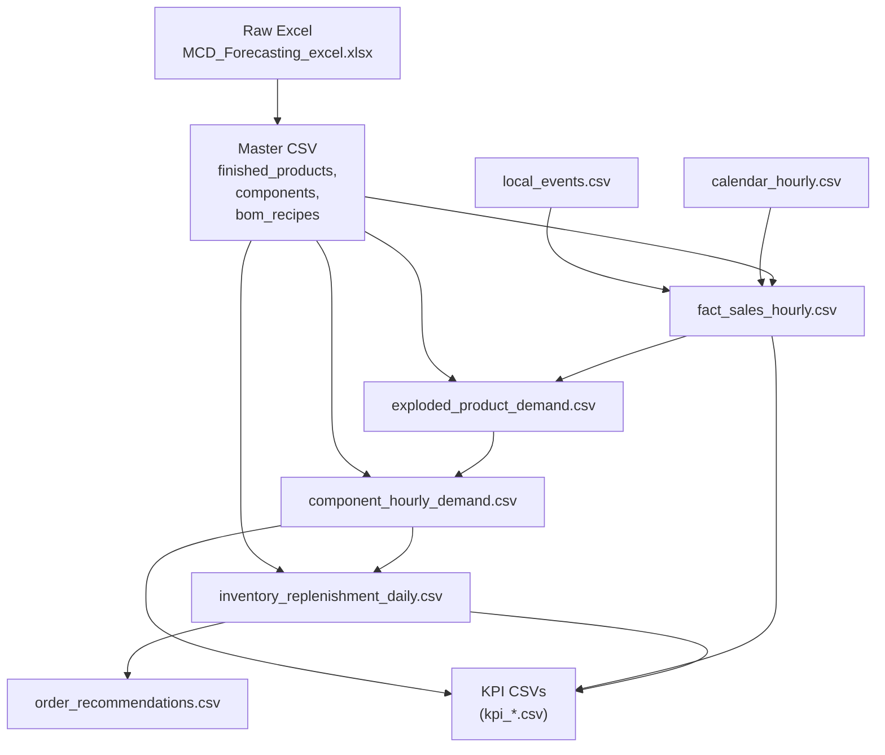
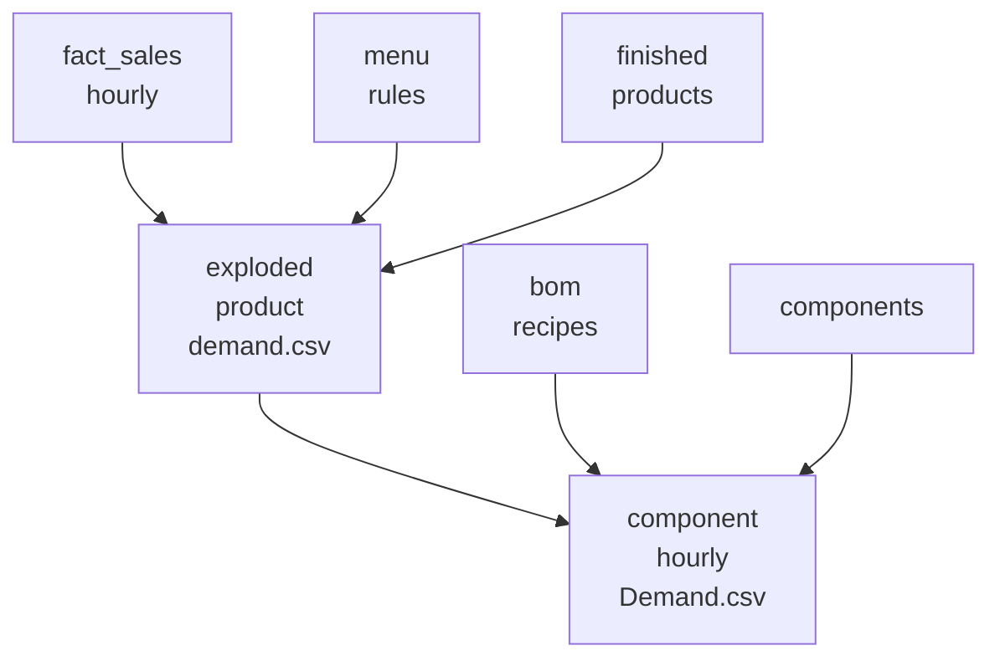
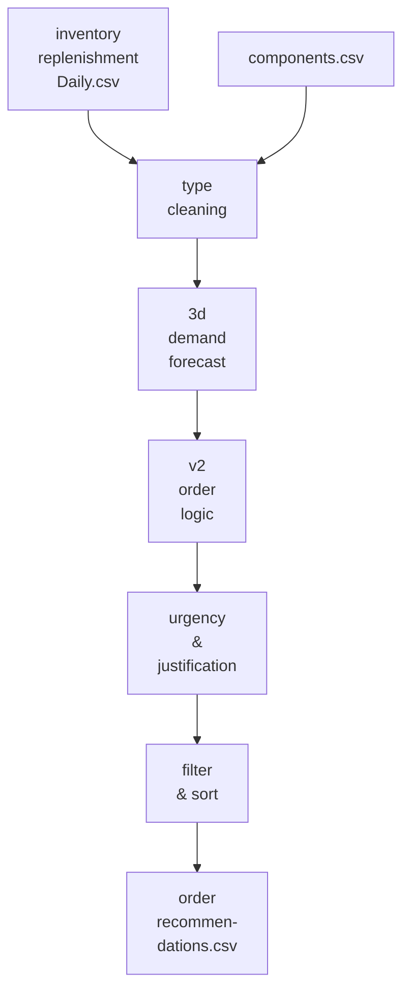
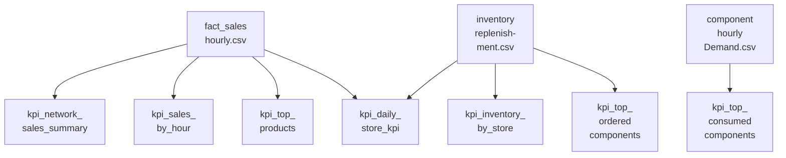
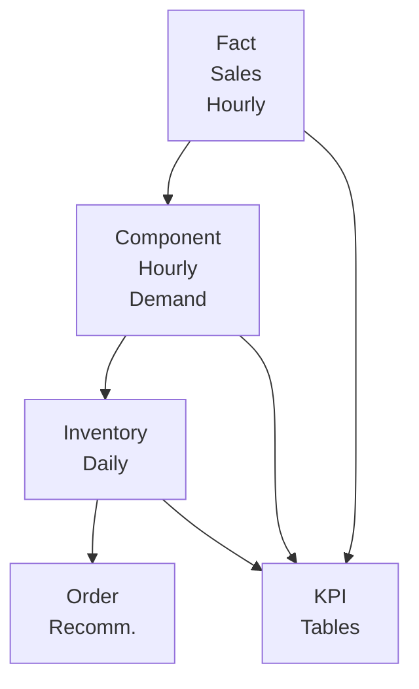

# Project Overview and Data Flow

**Related Files**:
- `mcd_forecasting_project/data/raw/MCD_Forecasting_excel.xlsx`
- `mcd_forecasting_project/data/processed/fact_sales_hourly.csv`
- `mcd_forecasting_project/data/processed/component_hourly_demand.csv`
- `mcd_forecasting_project/data/processed/inventory_replenishment_daily.csv`
- `mcd_forecasting_project/data/processed/order_recommendations.csv`
- `mcd_forecasting_project/data/processed/kpi_network_sales_summary.csv`
- `mcd_forecasting_project/data/processed/kpi_daily_store_kpi.csv`
- `mcd_forecasting_project/scripts/01_load_master_data.py`
- `mcd_forecasting_project/scripts/07_generate_hourly_sales.py`
- `mcd_forecasting_project/scripts/09_explode_sales_to_components.py`
- `mcd_forecasting_project/scripts/10_generate_inventory_and_replenishment.py`
- `mcd_forecasting_project/scripts/11_generate_order_recommendations.py`
- `mcd_forecasting_project/scripts/11_build_kpi_tables.py`

**Related Pages**:
- Master Data and Synthetic Environment
- Synthetic Sales Generation and Analysis
- From Sales to Component Demand and Inventory Simulation
- Order Recommendation Engine
- KPI and Reporting Layer

<details>
<summary>Relevant source files</summary>

The following files were used as context for generating this wiki page:

- [mcd_forecasting_project/data/raw/MCD_Forecasting_excel.xlsx](https://github.com/Insular2895/MCD_forecasting/blob/main/mcd_forecasting_project/data/raw/MCD_Forecasting_excel.xlsx)
- [mcd_forecasting_project/data/processed/fact_sales_hourly.csv](https://github.com/Insular2895/MCD_forecasting/blob/main/mcd_forecasting_project/data/processed/fact_sales_hourly.csv)
- [mcd_forecasting_project/data/processed/component_hourly_demand.csv](https://github.com/Insular2895/MCD_forecasting/blob/main/mcd_forecasting_project/data/processed/component_hourly_demand.csv)
- [mcd_forecasting_project/data/processed/inventory_replenishment_daily.csv](https://github.com/Insular2895/MCD_forecasting/blob/main/mcd_forecasting_project/data/processed/inventory_replenishment_daily.csv)
- [mcd_forecasting_project/data/processed/order_recommendations.csv](https://github.com/Insular2895/MCD_forecasting/blob/main/mcd_forecasting_project/data/processed/order_recommendations.csv)
- [mcd_forecasting_project/data/processed/kpi_network_sales_summary.csv](https://github.com/Insular2895/MCD_forecasting/blob/main/mcd_forecasting_project/data/processed/kpi_network_sales_summary.csv)
- [mcd_forecasting_project/data/processed/kpi_daily_store_kpi.csv](https://github.com/Insular2895/MCD_forecasting/blob/main/mcd_forecasting_project/data/processed/kpi_daily_store_kpi.csv)
- [mcd_forecasting_project/scripts/01_load_master_data.py](https://github.com/Insular2895/MCD_forecasting/blob/main/mcd_forecasting_project/scripts/01_load_master_data.py)
- [mcd_forecasting_project/scripts/02_validate_master_data.py](https://github.com/Insular2895/MCD_forecasting/blob/main/mcd_forecasting_project/scripts/02_validate_master_data.py)
- [mcd_forecasting_project/scripts/05_create_calendar_hourly.py](https://github.com/Insular2895/MCD_forecasting/blob/main/mcd_forecasting_project/scripts/05_create_calendar_hourly.py)
- [mcd_forecasting_project/scripts/06_create_local_events.py](https://github.com/Insular2895/MCD_forecasting/blob/main/mcd_forecasting_project/scripts/06_create_local_events.py)
- [mcd_forecasting_project/scripts/07_generate_hourly_sales.py](https://github.com/Insular2895/MCD_forecasting/blob/main/mcd_forecasting_project/scripts/07_generate_hourly_sales.py)
- [mcd_forecasting_project/scripts/08_analyze_sales_patterns.py](https://github.com/Insular2895/MCD_forecasting/blob/main/mcd_forecasting_project/scripts/08_analyze_sales_patterns.py)
- [mcd_forecasting_project/scripts/09_explode_sales_to_components.py](https://github.com/Insular2895/MCD_forecasting/blob/main/mcd_forecasting_project/scripts/09_explode_sales_to_components.py)
- [mcd_forecasting_project/scripts/10_generate_inventory_and_replenishment.py](https://github.com/Insular2895/MCD_forecasting/blob/main/mcd_forecasting_project/scripts/10_generate_inventory_and_replenishment.py)
- [mcd_forecasting_project/scripts/11_generate_order_recommendations.py](https://github.com/Insular2895/MCD_forecasting/blob/main/mcd_forecasting_project/scripts/11_generate_order_recommendations.py)
- [mcd_forecasting_project/scripts/11_build_kpi_tables.py](https://github.com/Insular2895/MCD_forecasting/blob/main/mcd_forecasting_project/scripts/11_build_kpi_tables.py)
</details>

# Project Overview and Data Flow

The MCD_forecasting project simulates restaurant sales, decomposes them into component demand, and derives inventory, replenishment, order recommendations, and KPI tables. The data pipeline is file-based, using CSVs generated step‑by‑step from master data and synthetic calendars/events to downstream operational outputs. Sources: [01_load_master_data.py](), [07_generate_hourly_sales.py](), [09_explode_sales_to_components.py](), [10_generate_inventory_and_replenishment.py](), [11_generate_order_recommendations.py](), [11_build_kpi_tables.py]()

This page documents the end‑to‑end data flow from raw Excel inputs through processed fact tables to inventory and KPI outputs. It focuses on how scripts interact via CSV artifacts, how demand is transformed from menu sales to component‑level consumption, and how order recommendations and KPI tables are derived from these datasets. Sources: [01_load_master_data.py](), [02_validate_master_data.py](), [05_create_calendar_hourly.py](), [06_create_local_events.py](), [08_analyze_sales_patterns.py]()

---

## High‑Level Architecture and Pipeline

### End‑to‑End Data Flow Overview

The project is organized as a linear pipeline of scripts operating on files in `data/raw` and `data/processed`. Raw Excel data is first exported to CSV, then validated. Calendar and events are generated, hourly sales are simulated, sales are exploded into components, inventory is simulated, order recommendations are produced, and finally KPI tables are built. Sources: [01_load_master_data.py:3-18](), [02_validate_master_data.py:3-35](), [05_create_calendar_hourly.py:1-18](), [06_create_local_events.py:1-18](), [07_generate_hourly_sales.py:1-40](), [09_explode_sales_to_components.py:1-120](), [10_generate_inventory_and_replenishment.py:1-60](), [11_generate_order_recommendations.py:1-110](), [11_build_kpi_tables.py:1-80]()



Sources: [01_load_master_data.py:3-18](), [05_create_calendar_hourly.py:9-18](), [06_create_local_events.py:1-18](), [07_generate_hourly_sales.py:1-40](), [09_explode_sales_to_components.py:1-120](), [10_generate_inventory_and_replenishment.py:40-72](), [11_generate_order_recommendations.py:1-40](), [11_build_kpi_tables.py:1-35]()

### Key Pipeline Stages

| Stage | Input | Output | Main Script | Purpose |
|-------|-------|--------|-------------|---------|
| Master data load | `MCD_Forecasting_excel.xlsx` | `finished_products.csv`, `components.csv`, `bom_recipes.csv` | `01_load_master_data.py` | Extracts product, component, and BOM definitions from Excel. |
| Master data validation | Master CSVs | (console output only) | `02_validate_master_data.py` | Checks shapes, missing values, duplicates, and BOM referential integrity. |
| Calendar generation | (internal date logic) | `calendar_hourly.csv` | `05_create_calendar_hourly.py` | Builds hourly calendar with weekday, weekend, holiday, and fair flags. |
| Local events | (script-defined) | `local_events.csv` | `06_create_local_events.py` | Defines store‑level events with traffic impact and active hours. |
| Hourly sales simulation | Master CSVs, `calendar_hourly.csv`, `local_events.csv` | `fact_sales_hourly.csv` | `07_generate_hourly_sales.py` | Simulates hourly product sales with price, revenue, and multipliers. |
| Explode to components | `fact_sales_hourly.csv`, master CSVs, BOM | `exploded_product_demand.csv`, `component_hourly_demand.csv` | `09_explode_sales_to_components.py` | Expands menu products and converts product sales to component demand. |
| Inventory & replenishment | `component_hourly_demand.csv`, master component data | `inventory_replenishment_daily.csv` | `10_generate_inventory_and_replenishment.py` | Simulates stock, safety stock, reorder points, and recommended orders. |
| Order recommendations | `inventory_replenishment_daily.csv`, `components.csv` | `order_recommendations.csv` | `11_generate_order_recommendations.py` | Refines order recommendations with 3‑day forecasts and urgency. |
| KPI tables | `fact_sales_hourly.csv`, `inventory_replenishment_daily.csv`, `component_hourly_demand.csv` | `kpi_*.csv` | `11_build_kpi_tables.py` | Aggregates sales and inventory KPIs by store, hour, component, and day. |

Sources: [01_load_master_data.py:3-18](), [02_validate_master_data.py:3-35](), [05_create_calendar_hourly.py:9-18](), [06_create_local_events.py:1-18](), [07_generate_hourly_sales.py:1-40](), [09_explode_sales_to_components.py:1-120](), [10_generate_inventory_and_replenishment.py:40-72](), [11_generate_order_recommendations.py:1-40](), [11_build_kpi_tables.py:1-80]()

---

## Master Data Extraction and Validation

### Loading Master Data from Excel

The project starts with a single Excel file `MCD_Forecasting_excel.xlsx` under `data/raw`. Sheet names `finished_products`, `components`, and `bom_recipes` are loaded into Pandas DataFrames and exported to CSV under `data/processed`. Sources: [01_load_master_data.py:3-18]()

```python
from pathlib import Path
import pandas as pd

BASE_DIR = Path(__file__).resolve().parents[1]

excel_file = BASE_DIR / "data" / "raw" / "MCD_Forecasting_excel.xlsx"
output_dir = BASE_DIR / "data" / "processed"
output_dir.mkdir(parents=True, exist_ok=True)

finished_products = pd.read_excel(excel_file, sheet_name="finished_products")
components = pd.read_excel(excel_file, sheet_name="components")
bom_recipes = pd.read_excel(excel_file, sheet_name="bom_recipes")

finished_products.to_csv(output_dir / "finished_products.csv", index=False)
components.to_csv(output_dir / "components.csv", index=False)
bom_recipes.to_csv(output_dir / "bom_recipes.csv", index=False)
```

Sources: [01_load_master_data.py:3-18]()

### Master Data Validation

Validation checks include:

- Printing shapes of `finished_products`, `components`, and `bom_recipes`.
- Counting missing values per column in each table.
- Detecting duplicate `product_id` in finished products and duplicate `component_id` in components.
- Ensuring BOM references only valid product and component IDs.
- Identifying duplicate (`product_id`, `component_id`) pairs in BOM. Sources: [02_validate_master_data.py:3-40]()

```python
finished_products = pd.read_csv(data_dir / "finished_products.csv")
components = pd.read_csv(data_dir / "components.csv")
bom_recipes = pd.read_csv(data_dir / "bom_recipes.csv")

valid_product_ids = set(finished_products["product_id"])
valid_component_ids = set(components["component_id"])

invalid_bom_products = bom_recipes.loc[~bom_recipes["product_id"].isin(valid_product_ids)]
invalid_bom_components = bom_recipes.loc[~bom_recipes["component_id"].isin(valid_component_ids)]

dup_bom = bom_recipes.duplicated(subset=["product_id", "component_id"]).sum()
```

Sources: [02_validate_master_data.py:3-40]()

---

## Calendar and Event Generation

### Hourly Calendar

An hourly calendar is generated with:

- `datetime_hour`, `year`, `month`, `day`.
- `day_of_week`, `is_weekend`, `is_wednesday`.
- `is_school_holiday`, `is_fair_period`, `is_fair_peak_weekend`. Sources: [05_create_calendar_hourly.py:9-18]()

The calendar is saved to `calendar_hourly.csv` in `data/processed`. Sources: [05_create_calendar_hourly.py:9-18]()

### Local Events Definition

Local events are defined as a Pandas DataFrame and exported to `local_events.csv`. Each event has:

- `event_id`, `event_name`.
- `start_date`, `end_date`.
- `target_store_id`.
- `event_type`.
- `traffic_uplift_pct`, `traffic_downlift_pct_other_store`.
- `active_hours` (comma‑separated string of hour integers). Sources: [06_create_local_events.py:1-18]()

Example event:

```python
{
    "event_id": "E004",
    "event_name": "Holiday week city center boost",
    "start_date": "2026-04-04",
    "end_date": "2026-04-08",
    "target_store_id": "S001",
    "event_type": "holiday_boost",
    "traffic_uplift_pct": 0.20,
    "traffic_downlift_pct_other_store": -0.05,
    "active_hours": "11,12,13,14,15,16,17,18"
}
```

Sources: [06_create_local_events.py:8-18]()

---

## Hourly Sales Simulation (`fact_sales_hourly.csv`)

### Inputs and Outputs

The hourly sales generation script loads:

- Stores and cluster configuration (not shown in the snippet but implied by references to `stores`). Sources: [07_generate_hourly_sales.py:35-40]()
- Local events from `local_events.csv`. Sources: [07_generate_hourly_sales.py:21-36]()
- Calendar from `calendar_hourly.csv` (used via `cal` rows). Sources: [07_generate_hourly_sales.py:21-36]()
- Product master data from `finished_products.csv` (implied by `product_id`, `product_name`, `category`, `is_menu`). Sources: [07_generate_hourly_sales.py:35-40]()

It outputs `fact_sales_hourly.csv` with at least these fields:

- `store_id`, `date`, `hour`, `datetime_hour`.
- `day_of_week`, `is_weekend`, `is_wednesday`, `is_school_holiday`, `is_fair_period`, `is_fair_peak_weekend`. Sources: [07_generate_hourly_sales.py:21-36]()
- `product_id`, `product_name`, `category`, `is_menu`.
- `qty_sold`, `unit_price`, `revenue`.
- `hour_multiplier`, `day_multiplier`, `event_multiplier`. Sources: [07_generate_hourly_sales.py:21-40]()

Example of row construction:

```python
rows.append({
    "store_id": store_id,
    "date": cal["date"],
    "hour": hour,
    "datetime_hour": cal["datetime_hour"],
    "day_of_week": cal["day_of_week"],
    "is_weekend": int(cal["is_weekend"]),
    "is_wednesday": int(cal["is_wednesday"]),
    "is_school_holiday": int(cal["is_school_holiday"]),
    "is_fair_period": int(cal["is_fair_period"]),
    "is_fair_peak_weekend": int(cal["is_fair_peak_weekend"]),
    "product_id": product_id,
    "product_name": product_name,
    "category": category,
    "is_menu": is_menu,
    "qty_sold": qty_sold,
    "unit_price": base_price,
    "revenue": revenue,
    "hour_multiplier": round(hm, 3),
    "day_multiplier": round(dm, 3),
    "event_multiplier": round(em, 3),
})
```

Sources: [07_generate_hourly_sales.py:21-40]()

`fact_sales_hourly.csv` is then exported and basic summary metrics (row count, total volume, total revenue) are printed. Sources: [07_generate_hourly_sales.py:33-40](), [fact_sales_hourly.csv]()

### Hourly, Daily, and Event Multipliers

The script defines three key multiplier functions:

- `hour_multiplier(hour, is_weekend, is_fair_period, is_fair_peak_weekend)`:
  - Increases base demand in specific hour ranges (e.g., 11–14 lunch, 18–20 evening).
  - Applies uplift for weekends and fair periods. Sources: [07_generate_hourly_sales.py:1-20]()

- `day_multiplier(day_of_week, is_weekend, is_school_holiday)`:
  - Applies multiplicative factors by weekday (e.g., Wednesday, Friday, Saturday, Sunday).
  - Adds uplift if `is_school_holiday == 1`. Sources: [07_generate_hourly_sales.py:20-31]()

- `event_multiplier(store_id, current_date, hour)`:
  - Iterates over rows in `local_events`.
  - Checks if the date is between `start_date` and `end_date` and hour is in `active_hours`.
  - If event targets the current store, multiplies by `(1 + traffic_uplift_pct)`.
  - Otherwise, if `traffic_downlift_pct_other_store != 0`, applies this percentage.
  - Ensures minimum uplift `0.05`. Sources: [07_generate_hourly_sales.py:31-40]()

```python
def event_multiplier(store_id, current_date, hour):
    uplift = 1.0

    for _, event in local_events.iterrows():
        start_date = pd.to_datetime(event["start_date"]).date()
        end_date = pd.to_datetime(event["end_date"]).date()
        active_hours = [int(x) for x in str(event["active_hours"]).split(",")]

        if start_date <= current_date <= end_date and hour in active_hours:
            if event["target_store_id"] == store_id:
                uplift *= (1 + event["traffic_uplift_pct"])
            else:
                if event["traffic_downlift_pct_other_store"] != 0:
                    uplift *= (1 + event["traffic_downlift_pct_other_store"])

    return max(uplift, 0.05)
```

Sources: [07_generate_hourly_sales.py:31-40]()

### Store Base Demand

A simple store base demand configuration is defined as a dictionary:

```python
store_base_lambda = {
    "S001": 22,  # Dreux centre ville
    "S002": 25,  # Vernouillet / haut de ville
}
```

Sources: [07_generate_hourly_sales.py:40-45]()

This base index is later used when generating Poisson‑like demand per store and hour (generation logic not fully shown in the snippet). Sources: [07_generate_hourly_sales.py:35-45]()

### Sales Analysis Utilities

A separate script `08_analyze_sales_patterns.py` reads `fact_sales_hourly.csv` to:

- Aggregate total sales by store.
- Aggregate sales by hour.
- Compare lunch vs evening sales for store `S001`.
- Compare fair vs non‑fair periods by store.
- Identify top products by total quantity.
- Aggregate by `day_of_week` and order weekdays in logical order. Sources: [08_analyze_sales_patterns.py:3-60]()

This script does not modify data but provides diagnostic and exploratory summaries.

---

## Sales Explosion to Component Demand

### Menu Expansion and Exploded Product Demand

`09_explode_sales_to_components.py` takes hourly sales and converts them into:

1. Exploded products (e.g., menu -> burger + fries + drink).
2. Component demand via the BOM.

Inputs:

- `fact_sales_hourly.csv` as `sales`.
- `bom_recipes.csv` as `bom`.
- `finished_products.csv` as finished product catalog.
- `components.csv` as component catalog. Sources: [09_explode_sales_to_components.py:120-150]()

A `menu_rules` DataFrame hard‑codes the decomposition of menu products:

```python
menu_rules = pd.DataFrame([
    {
        "menu_product_id": "P014",
        "menu_product_name": "Menu Big Mac",
        "main_product_id": "P001",
        "main_product_name": "Big Mac",
        "fries_m_share": 0.75,
        "fries_l_share": 0.05,
        "other_side_share": 0.20,
        "coke_m_share": 0.75,
        "coke_l_share": 0.05,
        "other_drink_share": 0.20,
    },
    {
        "menu_product_id": "P015",
        "menu_product_name": "Menu McChicken",
        "main_product_id": "P003",
        "main_product_name": "McChicken",
        "fries_m_share": 0.75,
        "fries_l_share": 0.05,
        "other_side_share": 0.20,
        "coke_m_share": 0.75,
        "coke_l_share": 0.05,
        "other_drink_share": 0.20,
    },
])
```

Sources: [09_explode_sales_to_components.py:120-145]()

Helper maps from product names to IDs are built using `finished_products.csv`. Specific product names such as `"Big Mac"`, `"McChicken"`, `"Frites M"`, `"Frites L"`, `"Coca M"`, `"Coca L"` are mapped to IDs. Sources: [09_explode_sales_to_components.py:145-160]()

For each row in `sales`:

- If `is_menu == 0`, the product is appended directly as an exploded row with `exploded_product_id == product_id` and `exploded_qty == qty_sold`. Sources: [09_explode_sales_to_components.py:160-180]()
- If `is_menu == 1`, the script:
  - Looks up the `menu_rule` by `menu_product_id`.
  - Adds one row for the main burger with `exploded_qty == qty_sold`.
  - Adds rows for medium and large fries based on `fries_m_share` and `fries_l_share`.
  - Adds rows for medium and large Coke based on `coke_m_share` and `coke_l_share`. Sources: [09_explode_sales_to_components.py:180-240]()

Example snippet for non‑menu products:

```python
if row["is_menu"] == 0:
    expanded_rows.append({
        "store_id": store_id,
        "date": date,
        "hour": hour,
        "datetime_hour": datetime_hour,
        "source_product_id": product_id,
        "source_product_name": product_name,
        "exploded_product_id": product_id,
        "exploded_product_name": product_name,
        "exploded_qty": qty_sold
    })
    continue
```

Sources: [09_explode_sales_to_components.py:160-180]()

Exploded rows are aggregated:

```python
expanded_sales = pd.DataFrame(expanded_rows)

exploded_product_demand = (
    expanded_sales
    .groupby(
        ["store_id", "date", "hour", "datetime_hour", "exploded_product_id", "exploded_product_name"],
        as_index=False
    )["exploded_qty"]
    .sum()
)

exploded_product_demand.to_csv(data_dir / "exploded_product_demand.csv", index=False)
```

Sources: [09_explode_sales_to_components.py:200-220]()

### Component Demand via BOM

For each exploded product:

- `matching_bom = bom[bom["product_id"] == exploded_product_id]`.
- For each matching BOM row, the script computes:
  - `qty_component_needed = exploded_qty * qty_per_product`. Sources: [09_explode_sales_to_components.py:220-245]()

```python
component_rows = []

for _, sale_row in exploded_product_demand.iterrows():
    exploded_product_id = sale_row["exploded_product_id"]
    exploded_qty = float(sale_row["exploded_qty"])

    matching_bom = bom[bom["product_id"] == exploded_product_id]

    for _, bom_row in matching_bom.iterrows():
        component_rows.append({
            "store_id": sale_row["store_id"],
            "date": sale_row["date"],
            "hour": sale_row["hour"],
            "datetime_hour": sale_row["datetime_hour"],
            "product_id": exploded_product_id,
            "product_name": sale_row["exploded_product_name"],
            "component_id": bom_row["component_id"],
            "qty_component_needed": exploded_qty * float(bom_row["qty_per_product"])
        })
```

Sources: [09_explode_sales_to_components.py:220-245]()

Component demand is then aggregated and enriched:

- Grouped by `["store_id", "date", "hour", "datetime_hour", "component_id"]` summing `qty_component_needed`.
- Enriched by joining with `components` on `component_id` to bring `component_name`, `component_type`, `storage_zone`, `unit_type`. Sources: [09_explode_sales_to_components.py:245-270]()

```python
component_demand = (
    component_demand
    .groupby(
        ["store_id", "date", "hour", "datetime_hour", "component_id"],
        as_index=False
    )["qty_component_needed"]
    .sum()
)

component_demand = component_demand.merge(
    components[["component_id", "component_name", "component_type", "storage_zone", "unit_type"]],
    on="component_id",
    how="left"
)

component_demand.to_csv(data_dir / "component_hourly_demand.csv", index=False)
```

Sources: [09_explode_sales_to_components.py:245-270](), [component_hourly_demand.csv]()

### Explosion Flow Diagram



Sources: [09_explode_sales_to_components.py:120-270](), [fact_sales_hourly.csv](), [component_hourly_demand.csv]()

---

## Inventory Simulation and Replenishment (`inventory_replenishment_daily.csv`)

### Inputs and Daily Demand Aggregation

`10_generate_inventory_and_replenishment.py` operates on a daily aggregation of `component_hourly_demand.csv` plus component attributes such as `units_per_case`, `storage_zone`, `unit_cost`, `waste_ratio_ops`, `waste_ratio_dlc`. These are joined into a `daily_demand` DataFrame grouped by `["store_id", "component_id"]`. Sources: [10_generate_inventory_and_replenishment.py:40-60](), [component_hourly_demand.csv]()

For each `(store_id, component_id)` group, sorted by date:

- `avg_daily_demand = grp["daily_component_demand"].mean()`.
- `units_per_case`, `storage_zone`, `unit_cost`, `waste_ratio_ops`, `waste_ratio_dlc` are extracted from the first row. Sources: [10_generate_inventory_and_replenishment.py:40-55]()

### Policy Functions

Three helper functions define inventory parameters by storage zone:

```python
def lead_time_days(storage_zone):
    if storage_zone == "negative":
        return 2
    if storage_zone == "cold":
        return 2
    if storage_zone == "dry":
        return 3
    return 2

def target_cover_days(storage_zone):
    if storage_zone == "negative":
        return 3
    if storage_zone == "cold":
        return 4
    if storage_zone == "dry":
        return 5
    return 4

def safety_factor(storage_zone):
    if storage_zone == "negative":
        return 0.35
    if storage_zone == "cold":
        return 0.30
    if storage_zone == "dry":
        return 0.25
    return 0.30
```

Sources: [10_generate_inventory_and_replenishment.py:2-25]()

### Stock Simulation Logic

For each component and store:

1. Compute:

   - `demand_std` as standard deviation of `daily_component_demand` (0 if NaN).
   - `safety_stock_units = avg_daily_demand * sf + demand_std * 0.5`.
   - `reorder_point_units = avg_daily_demand * lt_days + safety_stock_units`.
   - `target_stock_units = avg_daily_demand * cover_days + safety_stock_units`. Sources: [10_generate_inventory_and_replenishment.py:40-60]()

2. Initial `current_stock_units`:

   - Set to `max(target_stock_units, avg_daily_demand * 2)`. Sources: [10_generate_inventory_and_replenishment.py:55-60]()

3. For each date row:

   - Compute `daily_component_demand`, `waste_ops_units`, `waste_dlc_units`.
   - Total outflow: `total_outflow_units = daily_component_demand + waste_ops_units + waste_dlc_units`.
   - `opening_stock_units = current_stock_units`.
   - `closing_stock_pre_order_units = opening_stock_units - total_outflow_units`. Sources: [10_generate_inventory_and_replenishment.py:60-80]()

4. Flags:

   - `stockout_risk_flag`, `low_stock_flag`, `waste_risk_flag` (criteria not fully shown in snippet but computed per row and stored). Sources: [10_generate_inventory_and_replenishment.py:60-100]()

5. Recommended order:

   - `order_recommended_units` is rounded value computed against target and reorder level (implementation partially shown).
   - `order_recommended_cases` is cases equivalent based on `units_per_case`.
   - `closing_stock_post_order_units` accounts for incoming orders. Sources: [10_generate_inventory_and_replenishment.py:60-100]()

6. Row is appended to `results` with all computed values including `recommended_order_value = order_recommended_units * unit_cost`. Sources: [10_generate_inventory_and_replenishment.py:80-110]()

Finally, `inventory_replenishment_daily.csv` is created with all simulated inventory and order recommendation fields. Sources: [10_generate_inventory_and_replenishment.py:100-120](), [inventory_replenishment_daily.csv]()

### Inventory Record Fields

`inventory_replenishment_daily.csv` contains at least:

- Identification: `store_id`, `date`, `component_id`.
- Demand: `daily_component_demand`, `avg_daily_demand`, `demand_std`.
- Stock: `opening_stock_units`, `closing_stock_pre_order_units`, `closing_stock_post_order_units`.
- Policy: `lead_time_days`, `safety_stock_units`, `reorder_point_units`, `target_stock_units`.
- Orders: `order_recommended_units`, `order_recommended_cases`, `recommended_order_value`.
- Flags: `stockout_risk_flag`, `low_stock_flag`, `waste_risk_flag`. Sources: [10_generate_inventory_and_replenishment.py:60-110](), [inventory_replenishment_daily.csv]()

---

## Advanced Order Recommendations (`order_recommendations.csv`)

### Type Cleaning and Base Preparation

`11_generate_order_recommendations.py` refines the basic replenishment output.

It loads:

- `inventory_replenishment_daily.csv` as `inventory`.
- `components.csv` as `components`. Sources: [11_generate_order_recommendations.py:1-20]()

It coerces several columns to numeric types (if present) and converts `inventory["date"]` to datetime. Sources: [11_generate_order_recommendations.py:20-45]()

### 3‑Day Demand Forecast

The script computes a naïve rolling forecast of the next 3 days for each `(store_id, component_id)`:

```python
inventory = inventory.sort_values(["store_id", "component_id", "date"]).copy()

inventory["forecast_d1"] = inventory.groupby(["store_id", "component_id"])["daily_component_demand"].shift(-1)
inventory["forecast_d2"] = inventory.groupby(["store_id", "component_id"])["daily_component_demand"].shift(-2)
inventory["forecast_d3"] = inventory.groupby(["store_id", "component_id"])["daily_component_demand"].shift(-3)

inventory[["forecast_d1", "forecast_d2", "forecast_d3"]] = inventory[
    ["forecast_d1", "forecast_d2", "forecast_d3"]
].fillna(0)

inventory["forecast_next_3d"] = (
    inventory["forecast_d1"] + inventory["forecast_d2"] + inventory["forecast_d3"]
)
```

Sources: [11_generate_order_recommendations.py:45-65]()

`current_stock_units` is set to `closing_stock_post_order_units` (or 0 if NaN). Sources: [11_generate_order_recommendations.py:65-75]()

### Recommended Order Logic (v2)

A new recommendation function `compute_recommended_units` is applied per row:

```python
def compute_recommended_units(row):
    current_stock = row["current_stock_units"]
    reorder_point = row["reorder_point_units"]
    target_stock = row["target_stock_units"]
    forecast_3d = row["forecast_next_3d"]
    units_per_case = row["units_per_case"]

    if pd.isna(units_per_case) or units_per_case <= 0:
        units_per_case = 1

    # Base need:
    # - if below reorder point, replenish up to target
    # - if next 3 days forecast is above current stock, cover shortage too
    replenish_gap = max(target_stock - current_stock, 0)
    forecast_gap = max(forecast_3d - current_stock, 0)

    raw_need = max(replenish_gap, forecast_gap)

    if raw_need <= 0:
        return 0.0

    # Round to case size
    cases = np.ceil(raw_need / units_per_case)
    return float(cases * units_per_case)
```

Sources: [11_generate_order_recommendations.py:75-105]()

This yields:

- `recommended_order_units_v2`.
- `recommended_order_cases_v2 = recommended_order_units_v2 / units_per_case`.
- `recommended_order_value_v2 = recommended_order_units_v2 * unit_cost`. Sources: [11_generate_order_recommendations.py:100-115]()

### Urgency and Justification

Urgency levels are computed with `compute_urgency`:

```python
def compute_urgency(row):
    current_stock = row["current_stock_units"]
    reorder_point = row["reorder_point_units"]
    safety_stock = row["safety_stock_units"]
    forecast_3d = row["forecast_next_3d"]
    stockout_flag = row.get("stockout_risk_flag", 0)
    low_stock_flag = row.get("low_stock_flag", 0)

    if current_stock <= 0 or stockout_flag == 1:
        return "critical"
    if current_stock < safety_stock:
        return "high"
    if current_stock < reorder_point or low_stock_flag == 1:
        return "medium"
    if forecast_3d > current_stock:
        return "medium"
    return "low"
```

Sources: [11_generate_order_recommendations.py:115-135]()

A textual justification is built per row:

```python
def build_justification(row):
    reasons = []

    if row.get("stockout_risk_flag", 0) == 1:
        reasons.append("stockout risk")
    if row.get("low_stock_flag", 0) == 1:
        reasons.append("below reorder threshold")
    if row["current_stock_units"] < row["safety_stock_units"]:
        reasons.append("below safety stock")
    if row["forecast_next_3d"] > row["current_stock_units"]:
        reasons.append("next 3d demand exceeds current stock")
    if row.get("waste_risk_flag", 0) == 1:
        reasons.append("monitor waste risk")

    if not reasons:
        reasons.append("stable stock position")

    return " | ".join(reasons)
```

Sources: [11_generate_order_recommendations.py:135-160]()

`inventory["urgency_level"]` and `inventory["justification"]` are filled accordingly. Sources: [11_generate_order_recommendations.py:115-160]()

### Output Selection and Sorting

The final output:

- Selects a subset of columns, renaming `*_v2` fields to final names.
- Filters rows where `recommended_order_units > 0` or urgency is `critical`, `high`, or `medium`.
- Converts `date` back to string `YYYY-MM-DD`.
- Adds an `urgency_rank` for sorting.
- Sorts by `["date", "urgency_rank", "store_id", "recommended_order_value"]` (value descending). Sources: [11_generate_order_recommendations.py:160-210]()

```python
output_filtered = output[
    (output["recommended_order_units"] > 0) | (output["urgency_level"].isin(["critical", "high", "medium"]))
].copy()

urgency_order = {"critical": 1, "high": 2, "medium": 3, "low": 4}
output_filtered["urgency_rank"] = output_filtered["urgency_level"].map(urgency_order)

output_filtered = output_filtered.sort_values(
    ["date", "urgency_rank", "store_id", "recommended_order_value"],
    ascending=[True, True, True, False]
).drop(columns=["urgency_rank"])

output_filtered.to_csv(OUTPUT_PATH, index=False)
```

Sources: [11_generate_order_recommendations.py:160-210](), [order_recommendations.csv]()

### Recommendation Flow Diagram



Sources: [11_generate_order_recommendations.py:1-210](), [inventory_replenishment_daily.csv](), [order_recommendations.csv]()

---

## KPI Tables and Reporting

### Source Datasets

`11_build_kpi_tables.py` consumes:

- `fact_sales_hourly.csv` as `sales`.
- `inventory_replenishment_daily.csv` as `inventory`.
- `component_hourly_demand.csv` as `component_demand`. Sources: [11_build_kpi_tables.py:1-15]()

### KPI Tables

1. **Network Sales Summary** (`kpi_network_sales_summary.csv`):

   - Grouped by `store_id`.
   - Aggregates `total_qty_sold = sum(qty_sold)`, `total_revenue = sum(revenue)`. Sources: [11_build_kpi_tables.py:15-25](), [kpi_network_sales_summary.csv]()

2. **Sales by Hour** (`kpi_sales_by_hour.csv`):

   - Grouped by `hour`.
   - Same two aggregated fields. Sources: [11_build_kpi_tables.py:25-35]()

3. **Top Products** (`kpi_top_products.csv`):

   - Grouped by `["store_id", "product_name"]`.
   - Aggregates `total_qty_sold` and `total_revenue`.
   - Sorted by `["store_id", "total_qty_sold"]` descending by quantity. Sources: [11_build_kpi_tables.py:35-50]()

4. **Inventory KPI by Store** (`kpi_inventory_by_store.csv`):

   - Grouped by `store_id`.
   - Aggregated fields:
     - `total_order_value = sum(recommended_order_value)`.
     - `total_order_cases = sum(order_recommended_cases)`.
     - `stockout_flags`, `low_stock_flags`, `waste_risk_flags` as sums of boolean flags. Sources: [11_build_kpi_tables.py:50-65]()

5. **Top Ordered Components** (`kpi_top_ordered_components.csv`):

   - Grouped by `["store_id", "component_name"]`.
   - Aggregates `total_order_units`, `total_order_cases`, `total_order_value`.
   - Sorted by `["store_id", "total_order_value"]` descending. Sources: [11_build_kpi_tables.py:65-80]()

6. **Top Consumed Components** (`kpi_top_consumed_components.csv`):

   - Grouped by `["store_id", "component_name", "storage_zone"]`.
   - Aggregates `total_component_qty = sum(qty_component_needed)`.
   - Sorted by `["store_id", "total_component_qty"]` descending. Sources: [11_build_kpi_tables.py:80-95]()

7. **Daily Store KPI** (`kpi_daily_store_kpi.csv`):

   - `daily_store_sales`: `sales` grouped by `["store_id", "date"]` with total quantity and revenue.
   - `daily_store_inventory`: `inventory` grouped by `["store_id", "date"]` with total order value and aggregated flags.
   - Merged on `["store_id", "date"]` via left join. Sources: [11_build_kpi_tables.py:95-125](), [kpi_daily_store_kpi.csv]()

All KPI DataFrames are exported to their respective CSV files and printed to the console. Sources: [11_build_kpi_tables.py:95-140]()

### KPI Summary Table

| KPI File | Granularity | Main Metrics | Source Fields |
|----------|-------------|--------------|---------------|
| `kpi_network_sales_summary.csv` | Per store | `total_qty_sold`, `total_revenue` | `qty_sold`, `revenue` from `fact_sales_hourly.csv` |
| `kpi_sales_by_hour.csv` | Per hour | `total_qty_sold`, `total_revenue` | `qty_sold`, `revenue` from `fact_sales_hourly.csv` |
| `kpi_top_products.csv` | Per store & product | `total_qty_sold`, `total_revenue` | `product_name`, `qty_sold`, `revenue` |
| `kpi_inventory_by_store.csv` | Per store | `total_order_value`, `total_order_cases`, `stockout_flags`, `low_stock_flags`, `waste_risk_flags` | From `inventory_replenishment_daily.csv` |
| `kpi_top_ordered_components.csv` | Per store & component | `total_order_units`, `total_order_cases`, `total_order_value` | Order fields from `inventory_replenishment_daily.csv` |
| `kpi_top_consumed_components.csv` | Per store, component, storage zone | `total_component_qty` | `qty_component_needed` from `component_hourly_demand.csv` |
| `kpi_daily_store_kpi.csv` | Per store & date | Sales totals, order value, flags | From both `fact_sales_hourly.csv` and `inventory_replenishment_daily.csv` |

Sources: [11_build_kpi_tables.py:15-125](), [kpi_network_sales_summary.csv](), [kpi_daily_store_kpi.csv]()

### KPI Flow Diagram



Sources: [11_build_kpi_tables.py:15-125](), [kpi_network_sales_summary.csv](), [kpi_daily_store_kpi.csv]()

---

## Data Model Overview

### Core Fact Tables

| Table | Level | Purpose | Key Fields |
|-------|-------|---------|-----------|
| `fact_sales_hourly.csv` | Store–product–hour | Synthetic point‑of‑sale–like data with calendar/event context. | `store_id`, `date`, `hour`, `product_id`, `product_name`, `qty_sold`, `revenue`, `is_menu`, calendar flags, multipliers. |
| `component_hourly_demand.csv` | Store–component–hour | Derived component consumption per hour based on BOM and menu rules. | `store_id`, `date`, `hour`, `component_id`, `qty_component_needed`, `component_name`, `storage_zone`, `unit_type`. |
| `inventory_replenishment_daily.csv` | Store–component–day | Simulated stock levels, safety stock, reorder metrics, and recommended orders. | `opening_stock_units`, `closing_stock_pre_order_units`, `target_stock_units`, `order_recommended_units`, flags. |
| `order_recommendations.csv` | Store–component–day (filtered) | Actionable recommendations with urgency and justification. | `recommended_order_units`, `recommended_order_cases`, `urgency_level`, `justification`. |
| `kpi_*.csv` | Various | Aggregated KPIs for sales, components, and inventory per dimension. | Depends on file; generally counts, sums, and flags. |

Sources: [fact_sales_hourly.csv](), [component_hourly_demand.csv](), [inventory_replenishment_daily.csv](), [order_recommendations.csv](), [kpi_daily_store_kpi.csv](), [11_build_kpi_tables.py:15-125]()



Sources: [09_explode_sales_to_components.py:200-270](), [10_generate_inventory_and_replenishment.py:40-120](), [11_generate_order_recommendations.py:45-210](), [11_build_kpi_tables.py:15-125]()

---

## Conclusion

The MCD_forecasting project implements a coherent, file‑based simulation pipeline from master data and synthetic calendars to detailed component demand, inventory states, and actionable order recommendations. Each script contributes a clear transformation: master data extraction and validation, calendar and event modeling, hourly sales simulation, menu and BOM explosion, inventory simulation, and finally advanced recommendation and KPI generation. Together, these steps form a reproducible data flow suitable for analyzing how sales patterns drive component consumption and inventory decisions across stores. Sources: [01_load_master_data.py](), [07_generate_hourly_sales.py](), [09_explode_sales_to_components.py](), [10_generate_inventory_and_replenishment.py](), [11_generate_order_recommendations.py](), [11_build_kpi_tables.py]()
