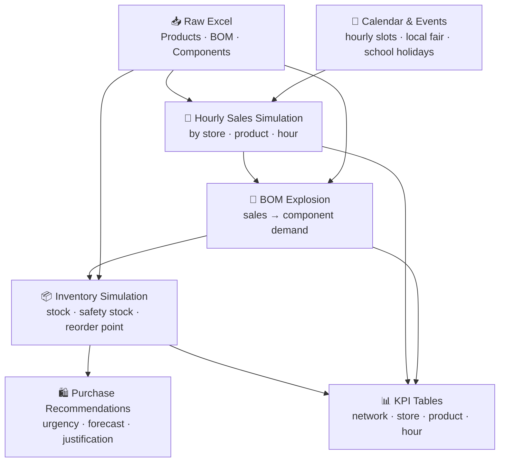

# 🍟 McDonald's Network Demand Forecasting & Replenishment Orchestration

> **Simulating a full-stack operations pipeline for a 2-store McDonald's network** —
> from synthetic hourly sales to actionable purchase recommendations, inventory alerts and executive KPIs.


---

## Table of Contents

- [Project Overview](#project-overview)
- [Business Objective](#business-objective)
- [End-to-End Pipeline](#end-to-end-pipeline)
- [Key Outputs](#key-outputs)
- [Dashboard](#dashboard)
- [Skills Demonstrated](#skills-demonstrated)
- [Tech Stack](#tech-stack)
- [How to Run](#how-to-run)
- [Repository Structure](#repository-structure)
- [Project Reflections](#project-reflections)

---

## Project Overview

This project simulates the full operational data cycle of a quick-service restaurant network — two McDonald's locations in Dreux, France.

The pipeline starts from a structured Excel workbook (products, recipes, components), generates realistic hourly sales with demand seasonality and local events, then cascades that demand through a Bill of Materials to produce daily inventory positions, replenishment signals and prioritised purchase recommendations.

The result is a **portfolio-grade operations analytics system** that mirrors what a real supply chain or restaurant ops analyst would build: grounded in business logic, end-to-end traceable, and decision-ready.

---

## Business Objective

| Challenge | What this project addresses |
|---|---|
| **Demand variability** | Simulate realistic peaks (lunch rush, weekends, school holidays, local fair) by store |
| **Stockout prevention** | Track daily inventory vs. reorder point and safety stock per component |
| **Waste reduction** | Flag overstock risk and DLC loss exposure per storage zone |
| **Replenishment automation** | Generate prioritised purchase orders with urgency levels and justification |
| **Network visibility** | Consolidate KPIs across both stores into a single operational dashboard |

---

## End-to-End Pipeline



| Step | Script | Output |
|---|---|---|
| 1. Load master data | `01_load_master_data.py` | `produits_finis.csv`, `composants.csv`, `recettes_bom.csv` |
| 2. Build calendar & events | `05–06_*.py` | `calendar_hourly.csv`, `local_events.csv` |
| 3. Generate hourly sales | `07_generate_hourly_sales.py` | `fact_sales_hourly.csv` |
| 4. Explode to components | `09_explode_sales_to_components.py` | `component_hourly_demand.csv` |
| 5. Simulate inventory | `10_generate_inventory_and_replenishment.py` | `inventory_replenishment_daily.csv` |
| 6. Build recommendations | `11_generate_order_recommendations.py` | `order_recommendations.csv` |
| 7. Aggregate KPIs | `11_build_kpi_tables.py` | `kpi_*.csv` |

---

## Key Outputs

**`fact_sales_hourly.csv`** — Granular hourly sales by store, product and time slot with multipliers (hour · day · event).

**`component_hourly_demand.csv`** — Component-level demand derived from the BOM, by store and hour.

**`inventory_replenishment_daily.csv`** — Daily stock simulation per component: opening stock, closing stock, safety stock, reorder point, recommended order.

**`order_recommendations.csv`** — Prioritised purchase lines with urgency (`critical` / `high` / `medium` / `low`), 3-day demand forecast and business justification.

**`kpi_*.csv`** — 7 KPI tables covering network sales, hourly patterns, top products, inventory by store, top components ordered and consumed, and daily store KPIs.

---

## Dashboard

A 5-page Streamlit dashboard provides an interactive view of the full pipeline output.

| Page | What it shows |
|---|---|
| **Executive Overview** | 10 network KPIs, revenue by store, alerts summary, purchase budget |
| **Demand & Product Mix** | Hourly revenue and units, top products by volume and value |
| **Store Operations** | Daily revenue, order value, inventory alert trends per store |
| **Purchase Recommendations** | Urgency breakdown, top components, filterable action table |
| **Business Insights** | 10 auto-generated insights + operational interpretation |

```bash
streamlit run app.py
```

---

## Skills Demonstrated

- **End-to-end pipeline design** — 11 chained scripts, each with a clear input/output contract
- **Demand simulation** — realistic hourly sales modelling with day-of-week, event and seasonal multipliers
- **BOM explosion logic** — translating menu sales into raw ingredient demand via a Bill of Materials
- **Inventory simulation** — safety stock, reorder point and target stock computation by storage zone
- **Replenishment engine** — rule-based order recommendation with 3-day rolling forecast and urgency scoring
- **KPI design** — operational metrics structured for both network-level and store-level decision-making
- **Dashboard delivery** — Streamlit + Plotly, portfolio-ready, filter-driven, 5 distinct analytical pages
- **Business translation** — connecting ops logic (QSR supply chain context) to a clean data model

---

## Tech Stack

| Tool | Usage |
|---|---|
|  | Pipeline, simulation, data transformation |
|  | All data wrangling and aggregation |
|  | Inventory calculations |
|| Interactive dashboard |
|  | Excel source file parsing |
| | Pipeline diagrams |

---

## How to Run

```bash
# 1. Clone the repo
git clone https://github.com/Insular2895/MCD.git
cd MCD

# 2. Install dependencies
pip install -r requirements.txt

# 3. Run the pipeline (in order)
python mcd_forecasting_project/scripts/01_load_master_data.py
python mcd_forecasting_project/scripts/05_create_calendar_hourly.py
python mcd_forecasting_project/scripts/06_create_local_events.py
python mcd_forecasting_project/scripts/07_generate_hourly_sales.py
python mcd_forecasting_project/scripts/09_explode_sales_to_components.py
python mcd_forecasting_project/scripts/10_generate_inventory_and_replenishment.py
python mcd_forecasting_project/scripts/11_generate_order_recommendations.py
python mcd_forecasting_project/scripts/11_build_kpi_tables.py

# 4. Launch the dashboard
streamlit run app.py
```

All processed outputs are written to `mcd_forecasting_project/data/processed/`.

---

## Repository Structure

<details>
<summary>View full structure</summary>

```
MCD/
├── app.py                              # Streamlit dashboard (5 pages)
├── requirements.txt
├── assumptions.md                      # Documented decisions and known data limits
├── README.md
├── mcd_forecasting_project/
│   ├── data/
│   │   ├── raw/
│   │   │   └── MCD_Forecasting_excel.xlsx
│   │   └── processed/
│   │       ├── produits_finis.csv
│   │       ├── composants.csv
│   │       ├── recettes_bom.csv
│   │       ├── calendar_hourly.csv
│   │       ├── local_events.csv
│   │       ├── fact_sales_hourly.csv
│   │       ├── component_hourly_demand.csv
│   │       ├── inventory_replenishment_daily.csv
│   │       ├── order_recommendations.csv
│   │       └── kpi_*.csv
│   └── scripts/
│       ├── 01_load_master_data.py
│       ├── 02_validate_master_data.py
│       ├── 05_create_calendar_hourly.py
│       ├── 06_create_local_events.py
│       ├── 07_generate_hourly_sales.py
│       ├── 08_analyze_sales_patterns.py
│       ├── 09_explode_sales_to_components.py
│       ├── 10_generate_inventory_and_replenishment.py
│       ├── 11_generate_order_recommendations.py
│       └── 11_build_kpi_tables.py
└── reports/
    ├── executive_report.md
    └── data_quality_report.md
```

</details>

---

## Project Reflections

Building this pipeline made clear that the hardest part of operations analytics isn't the aggregation — it's designing the intermediate data contracts cleanly. Keeping `inventory_replenishment_daily.csv` as the single source of truth between the simulation and the recommendation engine forced cleaner thinking about what each layer should and shouldn't know.

The BOM explosion step also surfaced an underappreciated challenge in QSR contexts: menu items aren't atomic. A Menu Big Mac is 3–4 distinct component pulls depending on customer choice (Frites M vs L, Coca M vs L). Modelling that probabilistically — rather than assuming a single decomposition — is what makes component demand realistic rather than mechanical.

**What I'd add next:**
- Replace the naive 3-day forecast with a proper time-series model (Prophet or simple exponential smoothing)
- Add store-level hourly breakdown to the product mix analysis
- Deploy the dashboard to Streamlit Cloud
- Build a CI step to regenerate outputs automatically on data change

---

*Simulation period: April 2026 · Stores: S001 (Dreux centre-ville) · S002 (Dreux haut de la ville)*
