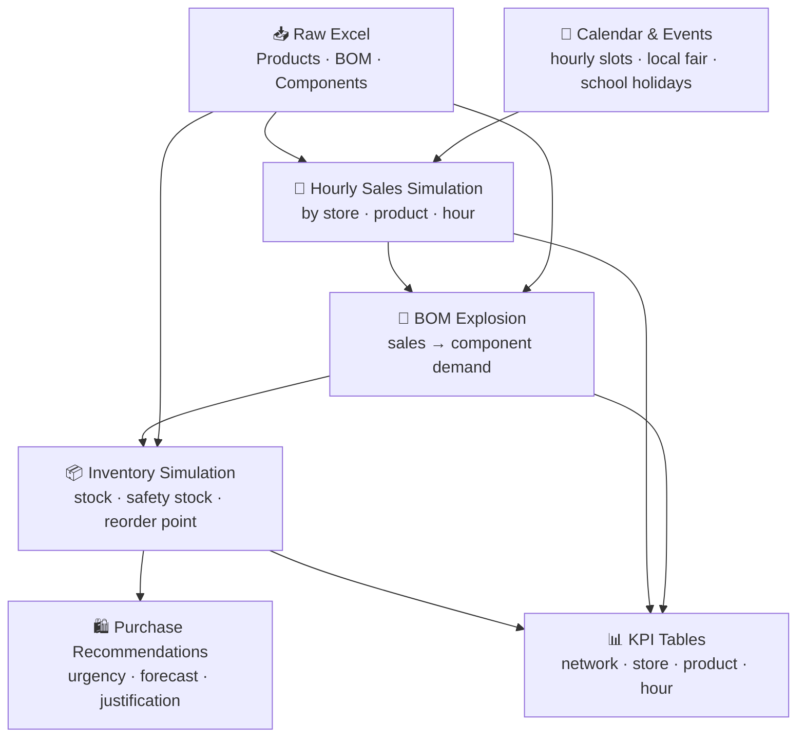

Readme · MD
Copier

# 🍟 McDonald's Network Demand Forecasting & Replenishment Orchestration
 
> **A proof-of-concept operations analytics pipeline for a 2-store McDonald's network** —
> from synthetic hourly sales to simulated purchase recommendations, inventory alerts and decision-support KPIs.
 


 
---
 
## Table of Contents
 
- [Project Overview](#project-overview)
- [Business Objective](#business-objective)
- [End-to-End Pipeline](#end-to-end-pipeline)
- [Key Outputs](#key-outputs)
- [Dashboard](#dashboard)
- [Skills Demonstrated](#skills-demonstrated)
- [Limitations & Assumptions](#limitations--assumptions)
- [Operational Recommendations](#operational-recommendations)
- [What a Real Deployment Would Require](#what-a-real-deployment-would-require)
- [Tech Stack](#tech-stack)
- [How to Run](#how-to-run)
- [Repository Structure](#repository-structure)
- [Project Reflections](#project-reflections)
---
 
## Project Overview
 
This project simulates the full operational data cycle of a quick-service restaurant network — two McDonald's locations in Dreux, France.
 
The pipeline starts from a structured Excel workbook (products, recipes, components), generates realistic hourly sales with demand seasonality and local events, then cascades that demand through a Bill of Materials to produce daily inventory positions, replenishment signals and prioritised purchase recommendations.
 
The goal is not to build a production-ready system, but to **demonstrate end-to-end analytical thinking**: how raw operational data can be structured, transformed, and surfaced into actionable decision-support outputs. This is a portfolio demonstration of data engineering, supply chain logic and business intelligence skills — not a deployed product.
 
---
 
## Business Objective
 
| Challenge | What this project demonstrates |
|---|---|
| **Demand variability** | Modelling realistic hourly sales peaks (lunch rush, weekends, school holidays, local events) by store |
| **Stockout prevention** | Tracking simulated daily inventory vs. reorder point and safety stock per component |
| **Waste reduction** | Flagging overstock risk and DLC loss exposure per storage zone |
| **Replenishment logic** | Generating rule-based, prioritised purchase signals with urgency levels and justification |
| **Network visibility** | Consolidating KPIs across two stores into a single decision-support dashboard |
 
---
 
## End-to-End Pipeline
 

 
| Step | Script | Output |
|---|---|---|
| 1. Load master data | `01_load_master_data.py` | `produits_finis.csv`, `composants.csv`, `recettes_bom.csv` |
| 2. Build calendar & events | `05–06_*.py` | `calendar_hourly.csv`, `local_events.csv` |
| 3. Generate hourly sales | `07_generate_hourly_sales.py` | `fact_sales_hourly.csv` |
| 4. Explode to components | `09_explode_sales_to_components.py` | `component_hourly_demand.csv` |
| 5. Simulate inventory | `10_generate_inventory_and_replenishment.py` | `inventory_replenishment_daily.csv` |
| 6. Build recommendations | `11_generate_order_recommendations.py` | `order_recommendations.csv` |
| 7. Aggregate KPIs | `11_build_kpi_tables.py` | `kpi_*.csv` |
 
---
 
## Key Outputs
 
**`fact_sales_hourly.csv`** — Granular hourly sales by store, product and time slot with demand multipliers (hour · day · event).
 
**`component_hourly_demand.csv`** — Component-level demand derived from the BOM, by store and hour.
 
**`inventory_replenishment_daily.csv`** — Daily stock simulation per component: opening stock, closing stock, safety stock, reorder point, simulated order quantity.
 
**`order_recommendations.csv`** — Rule-based purchase signals with urgency level (`critical` / `high` / `medium` / `low`), 3-day naive demand proxy and business justification string.
 
**`kpi_*.csv`** — 7 KPI tables covering network sales, hourly patterns, top products, inventory by store, top components ordered and consumed, and daily store KPIs.
 
---
 
## Dashboard
 
A 4-tab interactive dashboard provides a decision-support view of the full pipeline output. It is designed to answer four operational questions: how is demand evolving, which stores and products are performing, where are the operational risks, and what should be purchased next.
 
| Tab | What it shows |
|---|---|
| **Executive Overview** | 10 network KPIs, revenue by store, daily trend, alert summary, purchase budget |
| **Demand Analysis** | Hourly revenue and units (peak at 13h), top products by volume and by revenue |
| **Store & Products** | Daily revenue, units, and inventory alert trends per store |
| **Purchase Recommendations** | Urgency breakdown, top components by value and cases, filterable 688-row action table |
 

---
 
## Skills Demonstrated
 
- **End-to-end pipeline design** — 11 chained scripts, each with a clear input/output contract
- **Demand simulation** — hourly sales modelling with day-of-week, event and seasonal multipliers
- **BOM explosion logic** — translating menu sales into raw ingredient demand via a Bill of Materials
- **Inventory simulation** — safety stock, reorder point and target stock computation by storage zone
- **Prototype replenishment engine** — rule-based order recommendations with 3-day rolling demand proxy and urgency scoring
- **KPI design** — operational metrics structured for both network-level and store-level decision-making
- **Dashboard delivery** — interactive, filter-driven, 4-tab decision-support interface
- **Business translation** — connecting QSR supply chain logic to a structured data model
- **Data quality awareness** — explicit audit phase, anomaly documentation, documented assumptions
---
 
## Limitations & Assumptions
 
This project is a simulation and demonstration. The following limitations should be understood before drawing any operational conclusions from its outputs.
 
**Data**
- All sales data is synthetically generated from probability distributions and business rules. No real POS data was used.
- The BOM is simplified and based on assumed menu composition ratios — not validated against actual McDonald's recipes or supplier specifications.
- Revenue figures in `raw_daily_store_kpi` contain many zero-value entries due to an incomplete pipeline export. The network summary table (`raw_network_sales_summary`) is the more reliable revenue reference.
**Replenishment logic**
- Purchase recommendations are produced by a rule-based engine using static reorder points and a naive 3-day demand proxy (rolling shift). This is not a trained forecasting model.
- Urgency levels reflect proximity to reorder thresholds, not actual stockout probability.
- Some `unit_cost` values are corrupted in the source file (dates recorded instead of costs). Affected components are flagged in `data_quality_report.md` and excluded from unit-cost calculations.
**Scope**
- The pipeline covers a single simulated month (April 2026). Seasonal or structural patterns outside this window are not captured.
- There is no inter-store transfer logic. The two stores are treated as independent supply units.
- Storage zone constraints (cold chain, freezer capacity) are approximated, not modelled with real physical limits.
**What this means in practice:** the outputs are suitable for demonstrating analytical logic, pipeline structure and dashboard design. They should not be used to drive real purchasing decisions without significant calibration against actual sales data, supplier lead times and physical inventory.
 
---
 
## Operational Recommendations
 
Beyond what this prototype computes, a real multi-site analysis would surface a strategic lever that is often overlooked: **inter-store stock reallocation before external purchasing**.
 
In this two-store network:
 
- **S001 (centre-ville)** accumulates demand pressure during the local fair period, with sharp spikes on Friday through Sunday.
- **S002 (haut de la ville)** sees reduced traffic during the same period and may be holding surplus stock for components that S001 urgently needs.
A transfer-first policy would allow a multi-site franchisee to:
 
- **Check inter-site availability** before generating an external order recommendation
- **Reduce unnecessary purchase orders** and associated logistics costs
- **Limit overstock accumulation at S002** and the associated waste and DLC risk
- **Smooth stock tension at S001** without inflating the overall replenishment budget
- Use purchasing as a last lever, not the default first response
This logic requires a shared real-time inventory view across locations — which this prototype approximates with its daily KPI layer — and a decision rule that checks cross-site availability upstream of the order engine. It is documented as a priority next step in `assumptions.md`.
 
---
 
## What a Real Deployment Would Require
 
This project is a structured proof of concept. Moving from this prototype to a production-grade tool would require the following additions.
 
**Data infrastructure**
- Live POS integration to replace synthetic sales generation
- Real-time inventory feeds per storage zone (negative, cold, dry)
- Supplier lead times and minimum order quantities per component
- Historical data covering at least 12 months to capture seasonality properly
**Forecasting layer**
- Replacement of the naive 3-day demand proxy with a proper time-series model (Prophet, exponential smoothing, or gradient boosting on lagged features)
- Event calendar enrichment with school holiday schedules, local event data and promotional calendars
- Confidence intervals on demand forecasts to calibrate safety stock dynamically
**Replenishment engine**
- Inter-store transfer logic upstream of external order generation
- Supplier-aware ordering (minimum cases, delivery windows, order cut-off times)
- Dynamic reorder points recalibrated from rolling actuals rather than static rules
**Operations & governance**
- Field validation by store managers before order execution
- Feedback loop to measure forecast accuracy and adjust model parameters over time
- Role-based access in the dashboard (network-level vs. store-level views)
- Automated pipeline refresh on a daily or weekly cadence with output validation
---
 
## Tech Stack
 
| Tool | Usage |
|---|---|
|  | Pipeline, simulation, data transformation |
|  | Data transformation and aggregation |
|  | Master data setup and reporting |
|  | Dashboard and KPI visualisation |
|  | Excel input parsing |
|  | Pipeline diagrams |
 
---
 
## How to Run
 
```bash
# 1. Clone the repo
git clone https://github.com/Insular2895/MCD.git
cd MCD
 
# 2. Install dependencies
pip install -r requirements.txt
 
# 3. Run the pipeline (in order)
python mcd_forecasting_project/scripts/01_load_master_data.py
python mcd_forecasting_project/scripts/05_create_calendar_hourly.py
python mcd_forecasting_project/scripts/06_create_local_events.py
python mcd_forecasting_project/scripts/07_generate_hourly_sales.py
python mcd_forecasting_project/scripts/09_explode_sales_to_components.py
python mcd_forecasting_project/scripts/10_generate_inventory_and_replenishment.py
python mcd_forecasting_project/scripts/11_generate_order_recommendations.py
python mcd_forecasting_project/scripts/11_build_kpi_tables.py
 
# 4. Open the dashboard
streamlit run app.py
```
 
All processed outputs are written to `mcd_forecasting_project/data/processed/`.
 
---
 
## Repository Structure
 
<details>
<summary>View full structure</summary>
```
MCD/
├── app.py                              # Dashboard entry point
├── requirements.txt
├── assumptions.md                      # Documented decisions and known data limits
├── README.md
├── mcd_forecasting_project/
│   ├── data/
│   │   ├── raw/
│   │   │   └── MCD_Forecasting_excel.xlsx
│   │   └── processed/
│   │       ├── produits_finis.csv
│   │       ├── composants.csv
│   │       ├── recettes_bom.csv
│   │       ├── calendar_hourly.csv
│   │       ├── local_events.csv
│   │       ├── fact_sales_hourly.csv
│   │       ├── component_hourly_demand.csv
│   │       ├── inventory_replenishment_daily.csv
│   │       ├── order_recommendations.csv
│   │       └── kpi_*.csv
│   └── scripts/
│       ├── 01_load_master_data.py
│       ├── 02_validate_master_data.py
│       ├── 05_create_calendar_hourly.py
│       ├── 06_create_local_events.py
│       ├── 07_generate_hourly_sales.py
│       ├── 08_analyze_sales_patterns.py
│       ├── 09_explode_sales_to_components.py
│       ├── 10_generate_inventory_and_replenishment.py
│       ├── 11_generate_order_recommendations.py
│       └── 11_build_kpi_tables.py
└── reports/
    ├── executive_report.md
    └── data_quality_report.md
```
 
</details>
---
 
## Project Reflections
 
Building this pipeline made clear that the hardest part of operations analytics isn't the aggregation — it's designing the intermediate data contracts cleanly. Keeping `inventory_replenishment_daily.csv` as the single source of truth between the simulation and the recommendation engine forced cleaner thinking about what each layer should and shouldn't know.
 
The BOM explosion step also surfaced an underappreciated challenge in QSR contexts: menu items aren't atomic. A Menu Big Mac is 3–4 distinct component pulls depending on customer choice (Frites M vs L, Coca M vs L). Modelling that probabilistically — rather than assuming a single decomposition — is what makes component demand realistic rather than mechanical.
 
The audit phase was also more consequential than expected. Several columns in the source Excel contained corrupted data types (dates recorded as unit costs), headers offset by multiple rows, and revenue fields zeroed out for a large share of dates. Documenting these explicitly in `data_quality_report.md` and `assumptions.md` was as important as fixing them — it forces honesty about what the outputs actually represent.
 
**What I'd add next:**
- Replace the naive 3-day demand proxy with a proper time-series model (Prophet or exponential smoothing)
- Add inter-store transfer logic upstream of external purchase recommendations
- Add store-level hourly breakdown to the product mix analysis
- Deploy the pipeline on a daily refresh cadence with automated output validation
---
 
*Simulation period: April 2026 · Stores: S001 (Dreux centre-ville) · S002 (Dreux haut de la ville)*
*All data is synthetic. This project is a portfolio demonstration, not a production system.*
