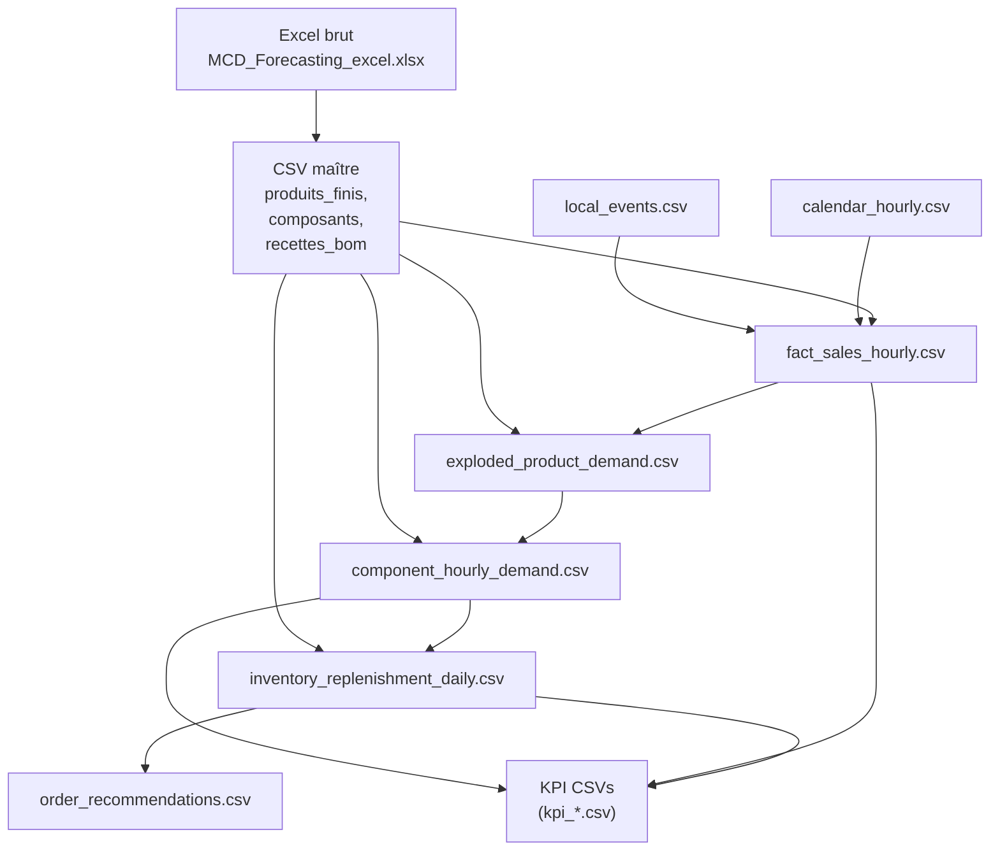
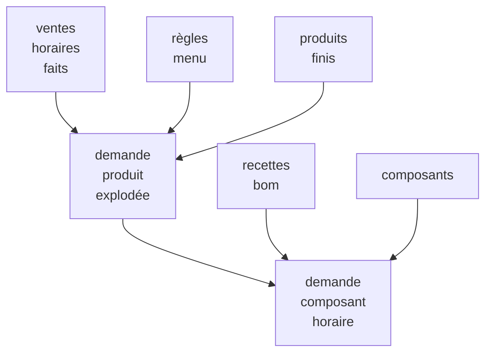
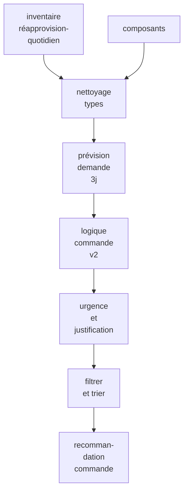
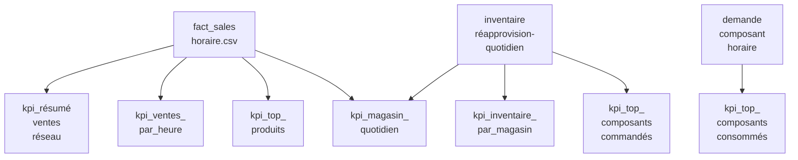
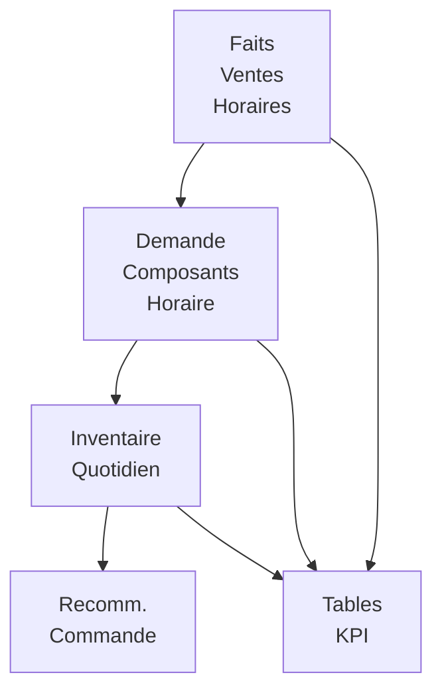

# Vue d'ensemble et flux de données du projet

**Fichiers associés** :
- `mcd_forecasting_project/data/raw/MCD_Forecasting_excel.xlsx`
- `mcd_forecasting_project/data/processed/fact_sales_hourly.csv`
- `mcd_forecasting_project/data/processed/component_hourly_demand.csv`
- `mcd_forecasting_project/data/processed/inventory_replenishment_daily.csv`
- `mcd_forecasting_project/data/processed/order_recommendations.csv`
- `mcd_forecasting_project/data/processed/kpi_network_sales_summary.csv`
- `mcd_forecasting_project/data/processed/kpi_daily_store_kpi.csv`
- `mcd_forecasting_project/scripts/01_load_master_data.py`
- `mcd_forecasting_project/scripts/07_generate_hourly_sales.py`
- `mcd_forecasting_project/scripts/09_explode_sales_to_components.py`
- `mcd_forecasting_project/scripts/10_generate_inventory_and_replenishment.py`
- `mcd_forecasting_project/scripts/11_generate_order_recommendations.py`
- `mcd_forecasting_project/scripts/11_build_kpi_tables.py`

**Pages associées** :
- Données maîtres et environnement synthétique
- Génération et analyse des ventes synthétiques
- De la demande de composants à la simulation d'inventaire
- Moteur de recommandation de commandes
- Couche KPI et reporting

<details>
<summary>Fichiers source pertinents</summary>

Les fichiers suivants ont été utilisés comme contexte pour générer cette page wiki :

- [mcd_forecasting_project/data/raw/MCD_Forecasting_excel.xlsx](https://github.com/Insular2895/MCD_forecasting/blob/main/mcd_forecasting_project/data/raw/MCD_Forecasting_excel.xlsx)
- [mcd_forecasting_project/data/processed/fact_sales_hourly.csv](https://github.com/Insular2895/MCD_forecasting/blob/main/mcd_forecasting_project/data/processed/fact_sales_hourly.csv)
- [mcd_forecasting_project/data/processed/component_hourly_demand.csv](https://github.com/Insular2895/MCD_forecasting/blob/main/mcd_forecasting_project/data/processed/component_hourly_demand.csv)
- [mcd_forecasting_project/data/processed/inventory_replenishment_daily.csv](https://github.com/Insular2895/MCD_forecasting/blob/main/mcd_forecasting_project/data/processed/inventory_replenishment_dai[...]
- [mcd_forecasting_project/data/processed/order_recommendations.csv](https://github.com/Insular2895/MCD_forecasting/blob/main/mcd_forecasting_project/data/processed/order_recommendations.csv)
- [mcd_forecasting_project/data/processed/kpi_network_sales_summary.csv](https://github.com/Insular2895/MCD_forecasting/blob/main/mcd_forecasting_project/data/processed/kpi_network_sales_summary.csv)
- [mcd_forecasting_project/data/processed/kpi_daily_store_kpi.csv](https://github.com/Insular2895/MCD_forecasting/blob/main/mcd_forecasting_project/data/processed/kpi_daily_store_kpi.csv)
- [mcd_forecasting_project/scripts/01_load_master_data.py](https://github.com/Insular2895/MCD_forecasting/blob/main/mcd_forecasting_project/scripts/01_load_master_data.py)
- [mcd_forecasting_project/scripts/02_validate_master_data.py](https://github.com/Insular2895/MCD_forecasting/blob/main/mcd_forecasting_project/scripts/02_validate_master_data.py)
- [mcd_forecasting_project/scripts/05_create_calendar_hourly.py](https://github.com/Insular2895/MCD_forecasting/blob/main/mcd_forecasting_project/scripts/05_create_calendar_hourly.py)
- [mcd_forecasting_project/scripts/06_create_local_events.py](https://github.com/Insular2895/MCD_forecasting/blob/main/mcd_forecasting_project/scripts/06_create_local_events.py)
- [mcd_forecasting_project/scripts/07_generate_hourly_sales.py](https://github.com/Insular2895/MCD_forecasting/blob/main/mcd_forecasting_project/scripts/07_generate_hourly_sales.py)
- [mcd_forecasting_project/scripts/08_analyze_sales_patterns.py](https://github.com/Insular2895/MCD_forecasting/blob/main/mcd_forecasting_project/scripts/08_analyze_sales_patterns.py)
- [mcd_forecasting_project/scripts/09_explode_sales_to_components.py](https://github.com/Insular2895/MCD_forecasting/blob/main/mcd_forecasting_project/scripts/09_explode_sales_to_components.py)
- [mcd_forecasting_project/scripts/10_generate_inventory_and_replenishment.py](https://github.com/Insular2895/MCD_forecasting/blob/main/mcd_forecasting_project/scripts/10_generate_inventory_and_replen[...]
- [mcd_forecasting_project/scripts/11_generate_order_recommendations.py](https://github.com/Insular2895/MCD_forecasting/blob/main/mcd_forecasting_project/scripts/11_generate_order_recommendations.py)
- [mcd_forecasting_project/scripts/11_build_kpi_tables.py](https://github.com/Insular2895/MCD_forecasting/blob/main/mcd_forecasting_project/scripts/11_build_kpi_tables.py)
</details>

# Vue d'ensemble et flux de données du projet

Le projet MCD_forecasting simule les ventes de restaurants, les décompose en demande de composants et génère des tableaux d'inventaire, de réapprovisionnement, de recommandations de commandes et de KPIs. Le pipeline de données est basé sur des fichiers [...]

Cette page documente le flux de données complet du début à la fin, depuis les entrées Excel brutes jusqu'aux tableaux de faits traités, aux inventaires et aux résultats KPI. Elle se concentre sur la façon dont les scripts interagissent via des artefacts CSV, sur la façon dont la demande est transformée [...]

---

## Architecture et pipeline de haut niveau

### Vue d'ensemble du flux de données de bout en bout

Le projet est organisé comme un pipeline linéaire de scripts opérant sur des fichiers dans `data/raw` et `data/processed`. Les données Excel brutes sont d'abord exportées en CSV, puis validées. Le calendrier et les événements sont générés [...]



Sources : [01_load_master_data.py:3-18](), [05_create_calendar_hourly.py:9-18](), [06_create_local_events.py:1-18](), [07_generate_hourly_sales.py:1-40](), [09_explode_sales_to_components.py:1-120](), [...]

### Étapes clés du pipeline

| Étape | Entrée | Sortie | Script principal | Objectif |
|-------|--------|--------|------------------|----------|
| Chargement données maîtres | `MCD_Forecasting_excel.xlsx` | `produits_finis.csv`, `composants.csv`, `recettes_bom.csv` | `01_load_master_data.py` | Extrait les définitions de produits, composants et nomenclature depuis Excel [...]
| Validation données maîtres | CSV maîtres | (sortie console uniquement) | `02_validate_master_data.py` | Vérifie les formes, valeurs manquantes, doublons et intégrité référentielle de la nomenclature. |
| Génération calendrier | (logique date interne) | `calendar_hourly.csv` | `05_create_calendar_hourly.py` | Construit calendrier horaire avec drapeaux jour semaine, weekend, vacances et fête. |
| Événements locaux | (défini dans script) | `local_events.csv` | `06_create_local_events.py` | Définit événements niveau magasin avec impact trafic et heures actives. |
| Simulation ventes horaires | CSV maîtres, `calendar_hourly.csv`, `local_events.csv` | `fact_sales_hourly.csv` | `07_generate_hourly_sales.py` | Simule ventes produits horaires avec prix, revenu et m[...]
| Explosion vers composants | `fact_sales_hourly.csv`, CSV maîtres, BOM | `exploded_product_demand.csv`, `component_hourly_demand.csv` | `09_explode_sales_to_components.py` | Développe produits menu et con[...]
| Inventaire & réapprovisionnement | `component_hourly_demand.csv`, données composant maître | `inventory_replenishment_daily.csv` | `10_generate_inventory_and_replenishment.py` | Simule stock, stock de sécurité,[...]
| Recommandations de commande | `inventory_replenishment_daily.csv`, `composants.csv` | `order_recommendations.csv` | `11_generate_order_recommendations.py` | Affine recommandations commande avec prévision 3 jours[...]
| Tables KPI | `fact_sales_hourly.csv`, `inventory_replenishment_daily.csv`, `component_hourly_demand.csv` | `kpi_*.csv` | `11_build_kpi_tables.py` | Agrège KPIs ventes et inventaire par magasin, heure[...]

Sources : [01_load_master_data.py:3-18](), [02_validate_master_data.py:3-35](), [05_create_calendar_hourly.py:9-18](), [06_create_local_events.py:1-18](), [07_generate_hourly_sales.py:1-40](), [09_expl[...]

---

## Extraction et validation des données maîtres

### Chargement des données maîtres depuis Excel

Le projet commence avec un unique fichier Excel `MCD_Forecasting_excel.xlsx` dans `data/raw`. Les noms de feuilles `produits_finis`, `composants` et `recettes_bom` sont chargés dans des DataFrames Pandas et exportés [...]

```python
from pathlib import Path
import pandas as pd

BASE_DIR = Path(__file__).resolve().parents[1]

excel_file = BASE_DIR / "data" / "raw" / "MCD_Forecasting_excel.xlsx"
output_dir = BASE_DIR / "data" / "processed"
output_dir.mkdir(parents=True, exist_ok=True)

produits_finis = pd.read_excel(excel_file, sheet_name="produits_finis")
composants = pd.read_excel(excel_file, sheet_name="composants")
recettes_bom = pd.read_excel(excel_file, sheet_name="recettes_bom")

produits_finis.to_csv(output_dir / "produits_finis.csv", index=False)
composants.to_csv(output_dir / "composants.csv", index=False)
recettes_bom.to_csv(output_dir / "recettes_bom.csv", index=False)
```

Sources : [01_load_master_data.py:3-18]()

### Validation des données maîtres

Les vérifications de validation incluent :

- Affichage des formes de `produits_finis`, `composants` et `recettes_bom`.
- Comptage des valeurs manquantes par colonne dans chaque table.
- Détection des `product_id` doublons en produits finis et `component_id` doublons en composants.
- Vérification que BOM ne référence que des ID produits et composants valides.
- Identification des paires (`product_id`, `component_id`) doublons en BOM. Sources : [02_validate_master_data.py:3-40]()

```python
produits_finis = pd.read_csv(data_dir / "produits_finis.csv")
composants = pd.read_csv(data_dir / "composants.csv")
recettes_bom = pd.read_csv(data_dir / "recettes_bom.csv")

valid_product_ids = set(produits_finis["product_id"])
valid_component_ids = set(composants["component_id"])

invalid_bom_products = recettes_bom.loc[~recettes_bom["product_id"].isin(valid_product_ids)]
invalid_bom_components = recettes_bom.loc[~recettes_bom["component_id"].isin(valid_component_ids)]

dup_bom = recettes_bom.duplicated(subset=["product_id", "component_id"]).sum()
```

Sources : [02_validate_master_data.py:3-40]()

---

## Génération du calendrier et des événements

### Calendrier horaire

Un calendrier horaire est généré avec :

- `datetime_hour`, `année`, `mois`, `jour`.
- `jour_semaine`, `est_weekend`, `est_mercredi`.
- `est_vacances_scolaires`, `est_periode_fete`, `est_weekend_pic_fete`. Sources : [05_create_calendar_hourly.py:9-18]()

Le calendrier est enregistré dans `calendar_hourly.csv` dans `data/processed`. Sources : [05_create_calendar_hourly.py:9-18]()

### Définition des événements locaux

Les événements locaux sont définis comme un DataFrame Pandas et exportés vers `local_events.csv`. Chaque événement contient :

- `event_id`, `event_name`.
- `start_date`, `end_date`.
- `target_store_id`.
- `event_type`.
- `traffic_uplift_pct`, `traffic_downlift_pct_other_store`.
- `active_hours` (chaîne de nombres d'heures séparés par des virgules). Sources : [06_create_local_events.py:1-18]()

Exemple d'événement :

```python
{
    "event_id": "E004",
    "event_name": "Boost vacances centre-ville",
    "start_date": "2026-04-04",
    "end_date": "2026-04-08",
    "target_store_id": "S001",
    "event_type": "boost_vacances",
    "traffic_uplift_pct": 0.20,
    "traffic_downlift_pct_other_store": -0.05,
    "active_hours": "11,12,13,14,15,16,17,18"
}
```

Sources : [06_create_local_events.py:8-18]()

---

## Simulation des ventes horaires (`fact_sales_hourly.csv`)

### Entrées et sorties

Le script de génération ventes horaires charge :

- Configuration magasins et clusters (non visible dans l'extrait mais implicite par références `magasins`). Sources : [07_generate_hourly_sales.py:35-40]()
- Événements locaux depuis `local_events.csv`. Sources : [07_generate_hourly_sales.py:21-36]()
- Calendrier depuis `calendar_hourly.csv` (utilisé via lignes `cal`). Sources : [07_generate_hourly_sales.py:21-36]()
- Données maîtres produits depuis `produits_finis.csv` (implicite par `product_id`, `product_name`, `category`, `is_menu`). Sources : [07_generate_hourly_sales.py:35-40]()

Il génère `fact_sales_hourly.csv` avec au moins ces champs :

- `store_id`, `date`, `hour`, `datetime_hour`.
- `jour_semaine`, `est_weekend`, `est_mercredi`, `est_vacances_scolaires`, `est_periode_fete`, `est_weekend_pic_fete`. Sources : [07_generate_hourly_sales.py:21-36]()
- `product_id`, `product_name`, `category`, `is_menu`.
- `qty_sold`, `unit_price`, `revenue`.
- `hour_multiplier`, `day_multiplier`, `event_multiplier`. Sources : [07_generate_hourly_sales.py:21-40]()

Exemple de construction de ligne :

```python
rows.append({
    "store_id": store_id,
    "date": cal["date"],
    "hour": hour,
    "datetime_hour": cal["datetime_hour"],
    "jour_semaine": cal["jour_semaine"],
    "est_weekend": int(cal["est_weekend"]),
    "est_mercredi": int(cal["est_mercredi"]),
    "est_vacances_scolaires": int(cal["est_vacances_scolaires"]),
    "est_periode_fete": int(cal["est_periode_fete"]),
    "est_weekend_pic_fete": int(cal["est_weekend_pic_fete"]),
    "product_id": product_id,
    "product_name": product_name,
    "category": category,
    "is_menu": is_menu,
    "qty_sold": qty_sold,
    "unit_price": base_price,
    "revenue": revenue,
    "hour_multiplier": round(hm, 3),
    "day_multiplier": round(dm, 3),
    "event_multiplier": round(em, 3),
})
```

Sources : [07_generate_hourly_sales.py:21-40]()

`fact_sales_hourly.csv` est ensuite exporté et les métriques résumées basiques (nombre de lignes, volume total, revenu total) sont affichées. Sources : [07_generate_hourly_sales.py:33-40](), [fact_sales_hourly.csv]()

### Multiplicateurs horaires, quotidiens et événementiels

Le script définit trois fonctions multiplicateurs clés :

- `heure_multiplicateur(heure, est_weekend, est_periode_fete, est_weekend_pic_fete)` :
  - Augmente la demande de base en plages horaires spécifiques (ex. 11–14 déjeuner, 18–20 soirée).
  - Applique augmentation pour weekends et périodes de fête. Sources : [07_generate_hourly_sales.py:1-20]()

- `jour_multiplicateur(jour_semaine, est_weekend, est_vacances_scolaires)` :
  - Applique facteurs multiplicatifs par jour semaine (ex. mercredi, vendredi, samedi, dimanche).
  - Ajoute augmentation si `est_vacances_scolaires == 1`. Sources : [07_generate_hourly_sales.py:20-31]()

- `evenement_multiplicateur(store_id, date_actuelle, heure)` :
  - Itère sur lignes `local_events`.
  - Vérifie si date est entre `start_date` et `end_date` et heure est dans `active_hours`.
  - Si événement cible magasin actuel, multiplie par `(1 + traffic_uplift_pct)`.
  - Sinon, si `traffic_downlift_pct_other_store != 0`, applique ce pourcentage.
  - Assure augmentation minimale `0.05`. Sources : [07_generate_hourly_sales.py:31-40]()

```python
def evenement_multiplicateur(store_id, date_actuelle, heure):
    augmentation = 1.0

    for _, event in local_events.iterrows():
        start_date = pd.to_datetime(event["start_date"]).date()
        end_date = pd.to_datetime(event["end_date"]).date()
        active_hours = [int(x) for x in str(event["active_hours"]).split(",")]

        if start_date <= date_actuelle <= end_date and heure in active_hours:
            if event["target_store_id"] == store_id:
                augmentation *= (1 + event["traffic_uplift_pct"])
            else:
                if event["traffic_downlift_pct_other_store"] != 0:
                    augmentation *= (1 + event["traffic_downlift_pct_other_store"])

    return max(augmentation, 0.05)
```

Sources : [07_generate_hourly_sales.py:31-40]()

### Demande de base par magasin

Une configuration simple demande de base magasin est définie comme dictionnaire :

```python
store_base_lambda = {
    "S001": 22,  # Dreux centre-ville
    "S002": 25,  # Vernouillet / haut de ville
}
```

Sources : [07_generate_hourly_sales.py:40-45]()

Cet index de base est utilisé ultérieurement lors de la génération demande Poisson-like par magasin et heure (logique génération non entièrement visible dans l'extrait). Sources : [07_generate_hourly_sales.py:35-45]()

### Utilitaires d'analyse ventes

Un script séparé `08_analyze_sales_patterns.py` lit `fact_sales_hourly.csv` pour :

- Agréger ventes totales par magasin.
- Agréger ventes par heure.
- Comparer ventes déjeuner vs soirée pour magasin `S001`.
- Comparer périodes fête vs hors-fête par magasin.
- Identifier produits top par quantité totale.
- Agréger par `jour_semaine` et ordonner jours logiquement. Sources : [08_analyze_sales_patterns.py:3-60]()

Ce script ne modifie pas données mais fournit résumés diagnostiques et exploratoires.

---

## Explosion des ventes vers demande de composants

### Expansion menu et demande explodée produits

`09_explode_sales_to_components.py` prend ventes horaires et les convertit en :

1. Produits explodés (ex. menu -> burger + frites + boisson).
2. Demande composants via la BOM.

Entrées :

- `fact_sales_hourly.csv` comme `ventes`.
- `recettes_bom.csv` comme `bom`.
- `produits_finis.csv` comme catalogue produits finis.
- `composants.csv` comme catalogue composants. Sources : [09_explode_sales_to_components.py:120-150]()

Un DataFrame `menu_rules` code dur la décomposition produits menu :

```python
menu_rules = pd.DataFrame([
    {
        "menu_product_id": "P014",
        "menu_product_name": "Menu Big Mac",
        "main_product_id": "P001",
        "main_product_name": "Big Mac",
        "frites_m_part": 0.75,
        "frites_l_part": 0.05,
        "autre_accompagnement_part": 0.20,
        "coca_m_part": 0.75,
        "coca_l_part": 0.05,
        "autre_boisson_part": 0.20,
    },
    {
        "menu_product_id": "P015",
        "menu_product_name": "Menu McChicken",
        "main_product_id": "P003",
        "main_product_name": "McChicken",
        "frites_m_part": 0.75,
        "frites_l_part": 0.05,
        "autre_accompagnement_part": 0.20,
        "coca_m_part": 0.75,
        "coca_l_part": 0.05,
        "autre_boisson_part": 0.20,
    },
])
```

Sources : [09_explode_sales_to_components.py:120-145]()

Des mappages auxiliaires de noms produits vers IDs sont construits à partir `produits_finis.csv`. Noms produits spécifiques comme `"Big Mac"`, `"McChicken"`, `"Frites M"`, `"Frites L"`, `"Coca M"`, `"Coca L"` sont mappés [...]

Pour chaque ligne `ventes` :

- Si `is_menu == 0`, le produit est ajouté directement comme ligne explodée avec `product_id_explode == product_id` et `qty_explode == qty_sold`. Sources : [09_explode_sales_to_components.py:160-180]()
- Si `is_menu == 1`, le script :
  - Cherche `menu_rule` par `menu_product_id`.
  - Ajoute ligne pour burger principal avec `qty_explode == qty_sold`.
  - Ajoute lignes frites medium et large basées sur `frites_m_part` et `frites_l_part`.
  - Ajoute lignes Coca medium et large basées sur `coca_m_part` et `coca_l_part`. Sources : [09_explode_sales_to_components.py:180-240]()

Extrait exemple pour produits non-menu :

```python
if row["is_menu"] == 0:
    expanded_rows.append({
        "store_id": store_id,
        "date": date,
        "hour": hour,
        "datetime_hour": datetime_hour,
        "product_id_source": product_id,
        "product_name_source": product_name,
        "product_id_explode": product_id,
        "product_name_explode": product_name,
        "qty_explode": qty_sold
    })
    continue
```

Sources : [09_explode_sales_to_components.py:160-180]()

Les lignes explodées sont agrégées :

```python
expanded_sales = pd.DataFrame(expanded_rows)

demande_produit_explode = (
    expanded_sales
    .groupby(
        ["store_id", "date", "hour", "datetime_hour", "product_id_explode", "product_name_explode"],
        as_index=False
    )["qty_explode"]
    .sum()
)

demande_produit_explode.to_csv(data_dir / "demande_produit_explode.csv", index=False)
```

Sources : [09_explode_sales_to_components.py:200-220]()

### Demande composants via BOM

Pour chaque produit explodé :

- `matching_bom = bom[bom["product_id"] == product_id_explode]`.
- Pour chaque ligne BOM correspondante, le script calcule :
  - `qty_composant_necessaire = qty_explode * qty_par_produit`. Sources : [09_explode_sales_to_components.py:220-245]()

```python
component_rows = []

for _, sale_row in demande_produit_explode.iterrows():
    product_id_explode = sale_row["product_id_explode"]
    qty_explode = float(sale_row["qty_explode"])

    matching_bom = bom[bom["product_id"] == product_id_explode]

    for _, bom_row in matching_bom.iterrows():
        component_rows.append({
            "store_id": sale_row["store_id"],
            "date": sale_row["date"],
            "hour": sale_row["hour"],
            "datetime_hour": sale_row["datetime_hour"],
            "product_id": product_id_explode,
            "product_name": sale_row["product_name_explode"],
            "component_id": bom_row["component_id"],
            "qty_composant_necessaire": qty_explode * float(bom_row["qty_par_produit"])
        })
```

Sources : [09_explode_sales_to_components.py:220-245]()

La demande composants est ensuite agrégée et enrichie :

- Groupée par `["store_id", "date", "hour", "datetime_hour", "component_id"]` en sommant `qty_composant_necessaire`.
- Enrichie en joignant avec `composants` sur `component_id` pour apporter `component_name`, `component_type`, `zone_stockage`, `type_unite`. Sources : [09_explode_sales_to_components.py:245-270]()

```python
demande_composant = (
    demande_composant
    .groupby(
        ["store_id", "date", "hour", "datetime_hour", "component_id"],
        as_index=False
    )["qty_composant_necessaire"]
    .sum()
)

demande_composant = demande_composant.merge(
    composants[["component_id", "component_name", "component_type", "zone_stockage", "type_unite"]],
    on="component_id",
    how="left"
)

demande_composant.to_csv(data_dir / "demande_composant_horaire.csv", index=False)
```

Sources : [09_explode_sales_to_components.py:245-270](), [demande_composant_horaire.csv]()

### Diagramme flux explosion



Sources : [09_explode_sales_to_components.py:120-270](), [fact_sales_hourly.csv](), [demande_composant_horaire.csv]()

---

## Simulation d'inventaire et réapprovisionnement (`inventory_replenishment_daily.csv`)

### Entrées et agrégation demande quotidienne

`10_generate_inventory_and_replenishment.py` fonctionne sur agrégation quotidienne `demande_composant_horaire.csv` plus attributs composants tels que `unites_par_case`, `zone_stockage`, `cout_unitaire`, `ratio_perte_[...]

Pour chaque groupe `(store_id, component_id)`, trié par date :

- `demande_quotidienne_moyenne = grp["demande_composant_quotidienne"].mean()`.
- `unites_par_case`, `zone_stockage`, `cout_unitaire`, `ratio_perte_ops`, `ratio_perte_dlc` sont extraits de première ligne. Sources : [10_generate_inventory_and_replenishment.py:40-55]()

### Fonctions de politique

Trois fonctions auxiliaires définissent paramètres inventaire par zone stockage :

```python
def delai_approvisionnement_jours(zone_stockage):
    if zone_stockage == "negatif":
        return 2
    if zone_stockage == "froid":
        return 2
    if zone_stockage == "sec":
        return 3
    return 2

def jours_couverture_cible(zone_stockage):
    if zone_stockage == "negatif":
        return 3
    if zone_stockage == "froid":
        return 4
    if zone_stockage == "sec":
        return 5
    return 4

def facteur_securite(zone_stockage):
    if zone_stockage == "negatif":
        return 0.35
    if zone_stockage == "froid":
        return 0.30
    if zone_stockage == "sec":
        return 0.25
    return 0.30
```

Sources : [10_generate_inventory_and_replenishment.py:2-25]()

### Logique simulation stock

Pour chaque composant et magasin :

1. Calculer :

   - `demande_std` comme écart-type `demande_composant_quotidienne` (0 si NaN).
   - `stock_securite_unites = demande_quotidienne_moyenne * fs + demande_std * 0.5`.
   - `point_recom_unites = demande_quotidienne_moyenne * delai_approv + stock_securite_unites`.
   - `stock_cible_unites = demande_quotidienne_moyenne * jours_couverture + stock_securite_unites`. Sources : [10_generate_inventory_and_replenishment.py:40-60]()

2. `stock_actuel_unites` initial :

   - Fixé à `max(stock_cible_unites, demande_quotidienne_moyenne * 2)`. Sources : [10_generate_inventory_and_replenishment.py:55-60]()

3. Pour chaque ligne date :

   - Calculer `demande_composant_quotidienne`, `perte_ops_unites`, `perte_dlc_unites`.
   - Flux sortant total : `flux_sortant_total_unites = demande_composant_quotidienne + perte_ops_unites + perte_dlc_unites`.
   - `stock_ouverture_unites = stock_actuel_unites`.
   - `stock_fermeture_pre_commande_unites = stock_ouverture_unites - flux_sortant_total_unites`. Sources : [10_generate_inventory_and_replenishment.py:60-80]()

4. Drapeaux :

   - `drapeau_risque_rupture`, `drapeau_stock_bas`, `drapeau_risque_perte` (critères non entièrement visibles dans extrait mais calculés par ligne et enregistrés). Sources : [10_generate_inventory_and_replenishment.py:60-100]()

5. Commande recommandée :

   - `unites_commande_recommandees` est valeur arrondie calculée selon cible et niveau réapprovisionnement (implémentation partiellement visible).
   - `cases_commande_recommandees` est équivalent cases basé sur `unites_par_case`.
   - `stock_fermeture_post_commande_unites` tient compte des commandes entrantes. Sources : [10_generate_inventory_and_replenishment.py:60-100]()

6. Ligne ajoutée `resultats` avec toutes valeurs calculées incluant `valeur_commande_recommandee = unites_commande_recommandees * cout_unitaire`. Sources : [10_generate_inventory_and_replenishment.py:80-110]()

Finalement, `inventory_replenishment_daily.csv` est créé avec tous champs simulés inventaire et recommandation commande. Sources : [10_generate_inventory_and_replenishment.py:100-120](), [inventory_replen[...]

### Champs enregistrement inventaire

`inventory_replenishment_daily.csv` contient au minimum :

- Identification : `store_id`, `date`, `component_id`.
- Demande : `demande_composant_quotidienne`, `demande_quotidienne_moyenne`, `demande_std`.
- Stock : `stock_ouverture_unites`, `stock_fermeture_pre_commande_unites`, `stock_fermeture_post_commande_unites`.
- Politique : `delai_approvisionnement_jours`, `stock_securite_unites`, `point_recom_unites`, `stock_cible_unites`.
- Commandes : `unites_commande_recommandees`, `cases_commande_recommandees`, `valeur_commande_recommandee`.
- Drapeaux : `drapeau_risque_rupture`, `drapeau_stock_bas`, `drapeau_risque_perte`. Sources : [10_generate_inventory_and_replenishment.py:60-110](), [inventory_replenishment_daily.csv]()

---

## Recommandations commande avancées (`order_recommendations.csv`)

### Nettoyage types et préparation base

`11_generate_order_recommendations.py` affine sortie réapprovisionnement basique.

Charge :

- `inventory_replenishment_daily.csv` comme `inventaire`.
- `composants.csv` comme `composants`. Sources : [11_generate_order_recommendations.py:1-20]()

Coerce plusieurs colonnes vers types numériques (si présentes) et convertit `inventaire["date"]` vers datetime. Sources : [11_generate_order_recommendations.py:20-45]()

### Prévision demande 3 jours

Le script calcule prévision naïve roulante 3 jours suivants pour chaque `(store_id, component_id)` :

```python
inventaire = inventaire.sort_values(["store_id", "component_id", "date"]).copy()

inventaire["prevision_j1"] = inventaire.groupby(["store_id", "component_id"])["demande_composant_quotidienne"].shift(-1)
inventaire["prevision_j2"] = inventaire.groupby(["store_id", "component_id"])["demande_composant_quotidienne"].shift(-2)
inventaire["prevision_j3"] = inventaire.groupby(["store_id", "component_id"])["demande_composant_quotidienne"].shift(-3)

inventaire[["prevision_j1", "prevision_j2", "prevision_j3"]] = inventaire[
    ["prevision_j1", "prevision_j2", "prevision_j3"]
].fillna(0)

inventaire["prevision_3j"] = (
    inventaire["prevision_j1"] + inventaire["prevision_j2"] + inventaire["prevision_j3"]
)
```

Sources : [11_generate_order_recommendations.py:45-65]()

`stock_actuel_unites` est fixé à `stock_fermeture_post_commande_unites` (ou 0 si NaN). Sources : [11_generate_order_recommendations.py:65-75]()

### Logique recommandation commande (v2)

Une nouvelle fonction recommandation `calcul_unites_recommandees` est appliquée par ligne :

```python
def calcul_unites_recommandees(row):
    stock_actuel = row["stock_actuel_unites"]
    point_recom = row["point_recom_unites"]
    stock_cible = row["stock_cible_unites"]
    prevision_3j = row["prevision_3j"]
    unites_par_case = row["unites_par_case"]

    if pd.isna(unites_par_case) or unites_par_case <= 0:
        unites_par_case = 1

    # Besoin base :
    # - si dessous point réapprovisionnement, reconstituer jusqu'à cible
    # - si prévision 3j suivants au-dessus stock actuel, couvrir pénurie aussi
    ecart_reconstitution = max(stock_cible - stock_actuel, 0)
    ecart_prevision = max(prevision_3j - stock_actuel, 0)

    besoin_brut = max(ecart_reconstitution, ecart_prevision)

    if besoin_brut <= 0:
        return 0.0

    # Arrondir à taille case
    cases = np.ceil(besoin_brut / unites_par_case)
    return float(cases * unites_par_case)
```

Sources : [11_generate_order_recommendations.py:75-105]()

Ceci produit :

- `unites_commande_recommandees_v2`.
- `cases_commande_recommandees_v2 = unites_commande_recommandees_v2 / unites_par_case`.
- `valeur_commande_recommandee_v2 = unites_commande_recommandees_v2 * cout_unitaire`. Sources : [11_generate_order_recommendations.py:100-115]()

### Urgence et justification

Niveaux urgence calculés avec `calcul_urgence` :

```python
def calcul_urgence(row):
    stock_actuel = row["stock_actuel_unites"]
    point_recom = row["point_recom_unites"]
    stock_securite = row["stock_securite_unites"]
    prevision_3j = row["prevision_3j"]
    drapeau_rupture = row.get("drapeau_risque_rupture", 0)
    drapeau_stock_bas = row.get("drapeau_stock_bas", 0)

    if stock_actuel <= 0 or drapeau_rupture == 1:
        return "critique"
    if stock_actuel < stock_securite:
        return "haute"
    if stock_actuel < point_recom or drapeau_stock_bas == 1:
        return "moyenne"
    if prevision_3j > stock_actuel:
        return "moyenne"
    return "basse"
```

Sources : [11_generate_order_recommendations.py:115-135]()

Une justification textuelle est construite par ligne :

```python
def construire_justification(row):
    raisons = []

    if row.get("drapeau_risque_rupture", 0) == 1:
        raisons.append("risque rupture")
    if row.get("drapeau_stock_bas", 0) == 1:
        raisons.append("sous seuil réapprovisionnement")
    if row["stock_actuel_unites"] < row["stock_securite_unites"]:
        raisons.append("sous stock de sécurité")
    if row["prevision_3j"] > row["stock_actuel_unites"]:
        raisons.append("demande 3j suivants dépasse stock actuel")
    if row.get("drapeau_risque_perte", 0) == 1:
        raisons.append("surveiller risque perte")

    if not raisons:
        raisons.append("position stock stable")

    return " | ".join(raisons)
```

Sources : [11_generate_order_recommendations.py:135-160]()

`inventaire["niveau_urgence"]` et `inventaire["justification"]` sont remplies en conséquence. Sources : [11_generate_order_recommendations.py:115-160]()

### Sélection sortie et tri

Sortie finale :

- Sélectionne sous-ensemble colonnes, renommant champs `*_v2` vers noms finaux.
- Filtre lignes où `unites_commande_recommandees > 0` ou urgence est `critique`, `haute` ou `moyenne`.
- Convertit `date` retour chaîne `YYYY-MM-DD`.
- Ajoute `classement_urgence` pour tri.
- Trie par `["date", "classement_urgence", "store_id", "valeur_commande_recommandee"]` (valeur décroissante). Sources : [11_generate_order_recommendations.py:160-210]()

```python
sortie_filtree = sortie[
    (sortie["unites_commande_recommandees"] > 0) | (sortie["niveau_urgence"].isin(["critique", "haute", "moyenne"]))
].copy()

ordre_urgence = {"critique": 1, "haute": 2, "moyenne": 3, "basse": 4}
sortie_filtree["classement_urgence"] = sortie_filtree["niveau_urgence"].map(ordre_urgence)

sortie_filtree = sortie_filtree.sort_values(
    ["date", "classement_urgence", "store_id", "valeur_commande_recommandee"],
    ascending=[True, True, True, False]
).drop(columns=["classement_urgence"])

sortie_filtree.to_csv(CHEMIN_SORTIE, index=False)
```

Sources : [11_generate_order_recommendations.py:160-210](), [order_recommendations.csv]()

### Diagramme flux recommandation



Sources : [11_generate_order_recommendations.py:1-210](), [inventory_replenishment_daily.csv](), [order_recommendations.csv]()

---

## Tables KPI et reporting

### Ensembles données sources

`11_build_kpi_tables.py` consomme :

- `fact_sales_hourly.csv` comme `ventes`.
- `inventory_replenishment_daily.csv` comme `inventaire`.
- `component_hourly_demand.csv` comme `demande_composant`. Sources : [11_build_kpi_tables.py:1-15]()

### Tables KPI

1. **Résumé ventes réseau** (`kpi_network_sales_summary.csv`) :

   - Groupé par `store_id`.
   - Agrège `total_qty_sold = sum(qty_sold)`, `total_revenue = sum(revenue)`. Sources : [11_build_kpi_tables.py:15-25](), [kpi_network_sales_summary.csv]()

2. **Ventes par heure** (`kpi_sales_by_hour.csv`) :

   - Groupé par `hour`.
   - Mêmes deux champs agrégés. Sources : [11_build_kpi_tables.py:25-35]()

3. **Produits top** (`kpi_top_products.csv`) :

   - Groupé par `["store_id", "product_name"]`.
   - Agrège `total_qty_sold` et `total_revenue`.
   - Trié par `["store_id", "total_qty_sold"]` décroissant par quantité. Sources : [11_build_kpi_tables.py:35-50]()

4. **KPI inventaire par magasin** (`kpi_inventory_by_store.csv`) :

   - Groupé par `store_id`.
   - Champs agrégés :
     - `total_order_value = sum(valeur_commande_recommandee)`.
     - `total_order_cases = sum(cases_commande_recommandees)`.
     - `drapeau_ruptures`, `drapeau_stock_bas`, `drapeau_risque_perte` comme sommes drapeaux booléens. Sources : [11_build_kpi_tables.py:50-65]()

5. **Composants commandés top** (`kpi_top_ordered_components.csv`) :

   - Groupé par `["store_id", "component_name"]`.
   - Agrège `total_order_units`, `total_order_cases`, `total_order_value`.
   - Trié par `["store_id", "total_order_value"]` décroissant. Sources : [11_build_kpi_tables.py:65-80]()

6. **Composants consommés top** (`kpi_top_consumed_components.csv`) :

   - Groupé par `["store_id", "component_name", "storage_zone"]`.
   - Agrège `total_component_qty = sum(qty_composant_necessaire)`.
   - Trié par `["store_id", "total_component_qty"]` décroissant. Sources : [11_build_kpi_tables.py:80-95]()

7. **KPI magasin quotidien** (`kpi_daily_store_kpi.csv`) :

   - `ventes_magasin_quotidiennes` : `ventes` groupées par `["store_id", "date"]` avec quantité totale et revenu.
   - `inventaire_magasin_quotidien` : `inventaire` groupé par `["store_id", "date"]` avec valeur commande totale et drapeaux agrégés.
   - Fusionnés sur `["store_id", "date"]` via jointure gauche. Sources : [11_build_kpi_tables.py:95-125](), [kpi_daily_store_kpi.csv]()

Tous DataFrames KPI sont exportés vers fichiers CSV respectifs et affichés console. Sources : [11_build_kpi_tables.py:95-140]()

### Tableau résumé KPI

| Fichier KPI | Granularité | Métriques principales | Champs sources |
|----------|-------------|--------------|---------------|
| `kpi_network_sales_summary.csv` | Par magasin | `total_qty_sold`, `total_revenue` | `qty_sold`, `revenue` de `fact_sales_hourly.csv` |
| `kpi_sales_by_hour.csv` | Par heure | `total_qty_sold`, `total_revenue` | `qty_sold`, `revenue` de `fact_sales_hourly.csv` |
| `kpi_top_products.csv` | Par magasin & produit | `total_qty_sold`, `total_revenue` | `product_name`, `qty_sold`, `revenue` |
| `kpi_inventory_by_store.csv` | Par magasin | `total_order_value`, `total_order_cases`, `drapeau_ruptures`, `drapeau_stock_bas`, `drapeau_risque_perte` | De `inventory_replenishment_daily.csv` |
| `kpi_top_ordered_components.csv` | Par magasin & composant | `total_order_units`, `total_order_cases`, `total_order_value` | Champs commande de `inventory_replenishment_daily.csv` |
| `kpi_top_consumed_components.csv` | Par magasin, composant, zone stockage | `total_component_qty` | `qty_composant_necessaire` de `component_hourly_demand.csv` |
| `kpi_daily_store_kpi.csv` | Par magasin & date | Totaux ventes, valeur commande, drapeaux | De `fact_sales_hourly.csv` et `inventory_replenishment_daily.csv` |

Sources : [11_build_kpi_tables.py:15-125](), [kpi_network_sales_summary.csv](), [kpi_daily_store_kpi.csv]()

### Diagramme flux KPI



Sources : [11_build_kpi_tables.py:15-125](), [kpi_network_sales_summary.csv](), [kpi_daily_store_kpi.csv]()

---

## Vue d'ensemble modèle données

### Tableaux faits principaux

| Table | Niveau | Objectif | Champs clés |
|-------|--------|----------|-----------|
| `fact_sales_hourly.csv` | Magasin–produit–heure | Données synthétiques type point vente avec contexte calendrier/événements. | `store_id`, `date`, `hour`, `product_id`, `product_name`, `qty_sold`, `reven[...]
| `component_hourly_demand.csv` | Magasin–composant–heure | Consommation composants dérivée par heure basée sur BOM et règles menu. | `store_id`, `date`, `hour`, `component_id`, `qty_composant_necessaire`, `[...]
| `inventory_replenishment_daily.csv` | Magasin–composant–jour | Niveaux stock simulés, stock sécurité, métriques réapprovisionnement et commandes recommandées. | `stock_ouverture_unites`, `stock_fermeture_pre_commande_unites[...]
| `order_recommendations.csv` | Magasin–composant–jour (filtré) | Recommandations actionnables avec urgence et justification. | `unites_commande_recommandees`, `cases_commande_recommandees`, `niveau_urgence`,[...]
| `kpi_*.csv` | Divers | KPIs agrégés pour ventes, composants et inventaire par dimension. | Dépend fichier ; généralement dénombrements, sommes et drapeaux. |

Sources : [fact_sales_hourly.csv](), [component_hourly_demand.csv](), [inventory_replenishment_daily.csv](), [order_recommendations.csv](), [kpi_daily_store_kpi.csv](), [11_build_kpi_tables.py:15-125]([...]



Sources : [09_explode_sales_to_components.py:200-270](), [10_generate_inventory_and_replenishment.py:40-120](), [11_generate_order_recommendations.py:45-210](), [11_build_kpi_tables.py:15-125]()

---

## Conclusion

Le projet MCD_forecasting implémente un pipeline simulation cohérent basé fichiers depuis données maîtres et calendriers synthétiques jusqu'à demande composants détaillée, états inventaire et recommandations commandes actionnables [...]
